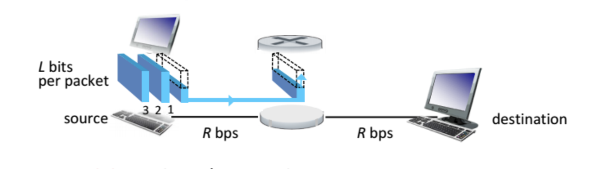

# 인터넷은 네트워크의 네트워크
네트워크는 연결이다. packet switch들과 communication link의 연결.

- End system: lower-tier ISP를 통해 인터넷에 연결된다.
- lower-tier ISP: 대학교, 회사, 공항, 카페 등 곳곳에 설치된 네트워크.
- upper-tier ISP: national, international. 고속 스위치 고속 링크 사용. 서로서로 연결되어 있다.

## 네트워크의 구성 요소
- Packet switches: packet을 forward한다. router와 switch가 있다.
- Communication links: 두 장치 사이 데이터를 전달하는 물리적/전파적 매체들. 광섬유, 구리선, 무선, 위성 등

## 인프라로서의 인터넷
인터넷이 program들 사이 데이터를 전달해주기 위해서 지켜야 하는 규칙의 모음이 있다. 그것이 socket interface다.

그것말고도 인터넷은 다양한 서비스를 제공한다.
  
## 프로토콜
> 프로토콜이 뭔지
프로토콜은 네트워크 요소들 사이 메세지를 주고받는 것에 대한 규칙이다. 
- 예: HTTP, streaming video, Skype, TCP, IP, WiFi, 4G, Ethernet
- 많이 쓰이는걸 협회에서 표준으로 정한다. RFC, IETF

# 네트워크들은 어떻게 서로 연결되는가
## Network edge
말단.

End system들은 application을 host(=run)하기 때문에 host라고도 불린다.

host에는 보통 client, server가 있고 server는 보통 데이터센터에 있다.

## Access Networks
End system들과 Edge router(다른 End system으로 가는 길에 있는 첫 번째 router)를 연결한다.

### Home Access
전화 연결은 DSL(Digital subscriber line). 이때 통신사가 ISP다. `WTF`
- 근데 전화 말고 인터넷연결도 한다. DSL의 데이터는 인터넷으로 가고 DSL의 목소리는 telephone net으로 간다

Cable은 텔레비전회사의 인프라를 사용 `WTF`
- frequency division multiplexing(FDM)은 서로 다른 주파수 대역에 서로 다른 channel이 전송된다.
서로 다른 주파수가 하나의 케이블 공유
- HFC(hybrid fiber coax)는 asymmetric하다. upstream과 downstream이 다르다.
- access network가 cable headend랑 연결되고 cable headend가 ISP에 연결된다는듯

FTTH(fiber to the home) `WTF`

5G fixed wireless: provider의 base station에서 집의 modem까지 무선으로 온다.

### Enterprise and University
LAN(Local area network): 여러가지 종류가 있음. 그중 Ethernet과 WiFi.

Ethernet: Institutional router에 연결된 Ethernet switch와 구리선으로 end system이 연결됨. `WTF`

WiFi: 유선 인터넷에 연결된 enterprise의 네트워크에 연결된 access point에서 수십 미터 안에 있는 사람들은 무선으로 연결 가능 `WTF`

### Wide-area wireless access
3G, LTE 4G, 5G

WiFi와 달리 base station에서 수십 킬로미터 안에 있으면 연결할 수 있다.

# Physical Medium

bit가 transmitter에서 receiver로 갈때 타는 물리적 물질
`WTF`
- twisted-pair copper wire(랜선)
- coaxial cable(동축케이블)
- multimode fiber-optic cable(광섬유케이블)
- terrestrial radio spectrum
- satellite radio spectrum

두개의 카테고리로 나뉨
- guided media: 단단한 물질
- unguided media: 대기나 우주에서 파장이 전파된다.

물질자체보다 설치노동비용이 크다. 그래서 미래를 대피해 여러종류 케이블을 한번에 깔아둔다.

## Twisted-pair copper wire(랜선)
저렴함. 흔함. 원래 전화 위해 쓰였었음.
두개의 copper wire가 꼬여서 감싸져있음.
Unshielded twisted pair는 건물의 LAN 위해서 쓰임.
bit rate가 좀 낮았지만 대체되지 않았고 집 인터넷에 잘 쓰이고 있음.

## Coaxial cable(동축케이블)
concentric한 두 copper 선.
데이터 전송속도가 빠름, 텔레비전 위해 많이 쓰임.
guided shared medium: 여러 end system이 cable에 직접 연결될 수 있음 -> 여러개가 같은 것 받음
양방향

## Fiber Optics(광섬유?)
가늘고유연한소재. 빛의 파동을 전달하는. 그 파동 각각이 bit임. bit rate엄청큼. 전자기 방해에 면역.

해외 등 장거리 연결에 쓰임. 멀리가도 감쇠가 거의 없음. 도청이 어려움. 장치가격이 비싸서 단거리엔 안씀.

## Terrestrial Radio Channels
배선 없이 신호 전송. 벽 통과. 이동사용자도 연결가능. 경로 손실, 간섭 문제. 거리에 따라 종류 나뉨.

전자기장에서 전송된다. 광역이고 단방향이다. 반사되고, 물체에 방해받는다.
- 예: 지상 마이크로파 통신, Wireless LAN(WiFi), wide-area(cellular), 위성

## Satellite Radio Channels
위성은 지상의 송수신기를 연결함. 한 주파수로 받아 다른 주파수로 재전송함. 높이때문에 지연 생김.

# Network Core
packet switch와 link들의 mesh.

## packet switching
메세지를 packet이라는 작은 단위로 나눠야 한다. packetdms link와 packet switch들을 타고 여행한다.

packet은 각 link를 그 link의 full transmission rate(그 링크가 허용하는 최고 속도)와 같은 rate로 타고 전송된다. 최고속도로 간다 함은 링크안에서 패킷이 속도를 조절할수 없다는 말이다.

따라서 출발지 end system이나 packet switch가 L bit의 packet을 transmission rate R bits/sec로 보내면 그 packet을 전송하는 시간은 L/R초이다.

### Store-and-Forward Transmission
도착한 패킷의 일부가 다음 링크로 전송되기 전에 packet switch에 packet 전체가 도착해야 한다.

두 system 사이 packet switch 1개, 링크 2개라면 store-and-forward때문에 패킷이 도착까지 걸리는 시간은 2L/R이다.

N=링크갯수 (N-1=라우터갯수)
end-to-end transmission delay = N * L/R

> 딜레이 로스 이해하기
### queueing delay, loss
각각의 packet switch에는 link 여러개가 붙어있다. 각각의 link를 위해서 output buffer가 있다. 어떤 packet이 가야 하는 link가 다른 packet을 보내고 있으면 `WTF` output buffer에서 기다려야 함. 그게 queueing delay임. 이 값은 네트워크의 congestion 등에 따라 달라진다.

buffer space는 유한하다. 그래서 마지막으로 도착한 packet이나 기다리던 packet들 중 하나가 버려진다. 그게 packet loss이다.

router에 패킷이 도착하는 속도가 transmission rate를 넘을 때 packet loss가 일어난다.

### Forwarding table과 routing protocol
router는 packet을 어떤 링크로 보낼지 어떻게 결정할까? 여러가지 방법이 있다.

인터넷의 end system들은 ip 주소를 가지고 있다. packet은 헤더에 도착지의 ip주소를 가지고 있다. router는 forwarding table을 가지고 있다. forwarding table은 도착지 주소의 일부와 outbound link를 매핑한다. router는 ip주소의 일부와 forwarding table을 보고 outbound link를 결정한다.

그런데 forwarding table은 어떻게 만들어질까? routing protocol으로 가장 짧은 길을 자동으로 만들음.

> 차이
## Circuit switching(회선교환)
데이터를 switch와 link의 네트워크를 통해 이동시키는 방법에는 두 방법이 있다. circuit switching(회선교환)과 앞에서 설명한 packet switching(패킷교환).

회선교환은
- 두 end system사이에 사용되는 리소스(buffer, transmission rate)가 그 세션의 duration만큼 reserve된다.
- 그래서 packet switch와 달리 기다릴 필요 없고 일정한 rate가 보장된다.
- 전통적 전화 네트워크가 그렇다.
- link는 예를들어 4가지의 회선을 가지고있어서 한 링크가 동시에 4개의 연결을 해줄 수 있다. 먼저 회선 하나를 reserve하면 소통을 할 수 있다. 링크속도가 1Mbps라면 한 회선은 250kbps이고 end-to-end 연결은 항상 250kbps의 속도를 가진다.

### Multiplexing in Circuit-switched network
link의 circuit은 FDM 또는 TDM으로 구현된다.

- Frequency Division Multiplexing(FDM): 한 link의 주파수 스펙트럼을 여러 구간으로 나누어, 각 connection에게 서로 다른 주파수 대역을 할당해준다.
  - 예를 들어 한 통화 connection마다 4khz의 주파수 대역을 준다. 4khz가 그 connnection의 bandwidth(대역폭)이다.
  - 라디오에서 88-108mhz라는 스펙트럼을 여러 방송국이 나눠 갖는다. 각 방송국은 자기만의 고정 주파수 대역을 가진다.
- Time Division Multiplexing(TDM): 시간이 고정된 duration의 Frame으로 나뉜다. 각 frame은 time slot의 고정된 숫자로 나뉜다. connection이 만들어지면 네트워크는 모든 frame의 time slot 하나를 할당한다.

따라서 FDM에서는 각 회선이 계속적으로 대역폭의 일부를 갖는다. TDM에서는 짧은 시간동안 대역폭 전체를 갖는다.

circuit switching은 데이터가 안 전달되는 동안 그 회선이 낭비된다는, 그리고 자원을 reserve하는게 복잡하다는 비판을 받는다.

## 비교
패킷스위칭은 변덕스러워서 realtime에 좋지않다고주장되기도함. 하지만 자원을 더 효율적으로쓰고 단순하고 싸다고 주장됨.

- 많은 유저가 가끔만 데이터를 보낼때 패킷스위칭은 더 많은 사용자를 동일한 성능으로 수용할 수 있다.
- 한 유저가 갑자기 대량 데이터를 보낼때 패킷스위칭은 링크를 독점하므로 같은 데이터를 더 빨리 전송할 수 있다.
`TBD`

# internet structure: network of networks
> hierarchy 계층구조

access ISP들이 있는건 알겠다. 통신사, 대학교, 회사 등. 그리고 그것이 유/무선으로 end system들을 연결해주는것도 알겠다. 그런데 access ISP들끼리는 어떻게 연결되는 걸까?

네트워크의 네트워크는 경제와 정책에 영향을 받으며 진화해 왔다. access ISP들은 서로서로 연결할 수도 있겠지만 모든 ISP들이 모든 ISP에 연결될수는 없다. 그래서 더 큰 ISP가 나온다면 그건 accessISP들을 연결해주는 대가로 돈을 받을 것이다. 돈을 받는다면 경쟁자가 생길 것이다.

ISP들은 가까이 있는 것들끼리 연결되는 것이 경제적으로 좋다. 그래서 regional ISP가 access ISP들을 연결한다. 그리고 regional ISP들은 tier-1 ISP에 의해 연결된다.

- PoP(Point of Presence): 접속 지점. customer ISP가 provider ISP에 연결하는 장소.
- Multihoming: 하나의 ISP가 여러 상위 ISP에 동시에 연결하는 것. 한쪽이 망가져도 연결 유지됨.
- Peering: 같은 계층의 ISP들이 서로 연결해 서로 트래픽 무료로 교환. 상위 ISP는 트래픽 요금 내야하니까.
  - IXP(Internet exchange point): 여러 ISP가 서로 peering하는 장소. 독립된 건물에 switch만 있음.

오늘날의 인터넷 구조: access ISP -> regional ISP -> Tier-1 ISP 구조 + 구글같은 대형콘텐츠제공자가 자체 글로벌 네트워크를 추가. 자체네트워크는 트래픽비용 줄이고 서비스전달경로 더 잘 통제가능.