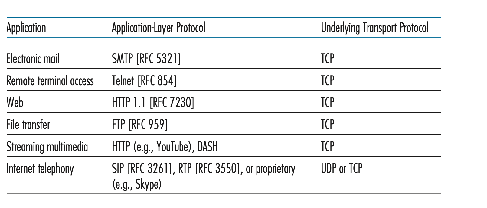

# Loss and Delay
데이터들을한번에 많이보내고싶지만 1초에 수송할수 있는 한계 throughput이 있어서 그럴수없다. throughput은 delay와 loss를 만들어낸다.

한 노드에 도착한 packet은 아웃풋 링크에 다른 packet이 없을 때만 전송될 수 있고, queue에 기다리는 다른 packet이 없을 때만 전송될 수 있다. 안그러면 queue에 들어가야 할 것이다.

# delay의 4가지 원인
한 노드의 delay를 d nodal이라고 한다. 한 노드마다 delay에는 여러가지 원인이 있다.

d nodal = d proc + d queue + d trans + d prop

## d proc
라우터가 packet을 처리하는데 걸리는 시간이 processing delay이다.

- check bit errors: 에러 있는지 확인
- determine output link
  - (pingpong: 계속 돌음)서비스에 따라 돌아가도 되는지 바로 가야하는지 다름. 메일은 타임에 민감하지 않음. 실시간이 중요한 데이터도 있음. 이런건 타임 조정이 필요함. ttl 오버했는지 어디에 몇번이나 갔는지 보고 버림.

## d queue
링크에 전송되기 위해 기다리는 시간이 queueing delay다. 0에서부터 microsecond, millisecond.

그 packet의 모든 정보가 라우터에 도착하면(queue에 도착하면?) packet이 전송될 수 있다. `TBD`

## d trans
packet의 모든 bit을 link로 밀어넣는데 걸리는 시간이 transmission delay이다.

- l(packet length bits) / r(link transmission rate bps)
- 여기서의 r 전송 속도는 링크의 대역폭(bandwidth) 즉 1초안에 링크로 얼마나 많은 bit를 넣을 수 있는지.

## d prop
링크의 시작부터 다음라우터까지 걸리는 시간이 propagation delay이다. 링크의 속성과 길이에 관련있다.

- d(length of physical link) / s(propagation speed)
- 여기서의 s 전송 속도는 링크의 전파 속도이다. packet은 링크의 속도로 간다.

## caravan 비유
- 차는 bit, 차의 행렬은 packet
- 차는 100km/hr 속도로 전파한다.
- 톨게이트는 12초 동안 transmission 한다.
- 톨게이트 간 사이는 100km이다.
- 10대의 차가 두 번째 톨게이트에 도착하는 데 걸리는 시간은?

=> 톨게이트로 밀어넣는 시간 = 10*12초 = 2분, 마지막 차가 2번째 톨게이트까지 가는데 1시간 => 62분.

- 차는 1000km/hr로 전파
- 톨게이트는 1분 걸림
- 모든 차가 첫번째 톨게이트를 통과하기 전에 두번째 톨게이트에 도착하는 차가 있을까?

=> 모든 차가 톨게이트를 지나가는 시간 10*60초 = 10분, 차 한 대가 두번째 톨게이트까지 전파하는 시간 1/10시간=6분 => 7분 후 첫번째 차가 두번째 톨게이트에 도착하고 3대가 첫 톨게이트에 있다.

## Queueing Delay
queueing delay는 packet마다 다르다. 그래서 queueing delay를 특정할 때 주로 평균을 내거나 변화값이나 어떤 값을 넘을 확률 등 통계적으로 계산하곤한다.

- L: 패킷 길이(bits)
- a: 초당 도착하는 패킷 수(packets/sec)
- R: 링크 대역폭(bits/sec)

La/R 값이 1을 넘는 순간부터는 처리 능력보다 일이 더 많이 들어와서 지연이 폭발한다. 이게 통계적인 값인가? 아니면 그 순간의 값인가?`TBD`

1초 동안 도착하는 비트 수 = L * a
1초 동안 링크가 처리할 수 있는 비트 수 = R

따라서 La/R = 도착 비트율/처리 비트율 = 트래픽의 정도.

La/R < 1
- 도착량이 처리량보다 적다. 지연이 적고 안정적

La/R = 1
- 도착량 = 처리량
- 꽉 찬 상태

La/R > 1
- 도착량이 처리량보다 많다. 들어오는 패킷이 항상 나가는 패킷보다 많다. 줄이 무한정 쌓인다. 평균 지연이 이론적으로 무한대가 된다.

packet이 도착하는 텀은 매번 랜덤하다. La/R이 1에 가까워지면 조금만 높아져도 queueing delay가 큰 폭으로 커진다.

# Packet loss
꽉 찬 큐에 들어오는 packet(또는 큐에 들어있던 packet)은 버려진다.
전체 네트워크 관점에서 보면 packet이 전송되었는데 도착지에서 못 받은 것임. 트래픽 혼잡도가 높을수록 packet loss가 많다.

버려진 패킷은 이전 노드에 의해 재전송될 수도 있고 아닐 수도 있다.

# End-to-End Delay
d nodal은 라우터 한 개의 delay다.
N은 링크 갯수, N-1이 라우터 갯수.
네트워크가 안 혼잡해서 queueing delay가 없다고 치면

d end-to-end = N(d proc + d trans + d prop)이다.

### traceroute
host에서 실행하는, 딜레이를 측정하는 프로그램.
도착 hostname을 명시 -> 도착지로 여러개의 특별한 packet을 보냄 -> 여러개의 라우터를 거침 -> 라우터가 이 packet을 받으면 전송자에게 라우터의 name과 address를 담은 짧은 메세지를 보냄 -> 전송자가 transmission과 reply의 시간차를 측정함. `TBD`

## throughput
bit이 sender에서 receiver로 가는 rate(bits/시간단위)
- instantaneous: 1초에 받는 bit / 1초
- average: 전체 bit / 전체 bit를 받는 데 걸리는 시간

이전 링크의 rate < 이후 링크의 rate이면 이후 링크가 빨라도 어쨌든 router에 온 packet만 보낼 수 있으니까 전체 rate는 이전 링크의 rate가 된다. `TBD`
이전 링크의 rate > 이후 링크의 rate이면 빠르게 와도 천천히 나가니까 queue는 계속 늘어나고 `TBD`(그럼 항상 이후링크가 이전링크보다 rate가 커야돼..?) 이후 링크의 rate가 된다.

그래서 throughput은 min{Rc,Rs}, 즉 bottleneck link의 transmission rate이 end-to-end throughput이 된다.

그래서 보통 throughput제한요소는 core network이 아니라 access network 쪽이다. 근데 한 링크가 여러 access link들이 공유해서 throughput을 나눠주느라 더 적어졌다? 그러면 걔가 bottleneck이 되는거임.

# network security
원래 인터넷은 서로 믿는 연구자들이 쓰는 네트워크로 만들어져서 보안을 별로 고려하지 않았다. 나중에 전세계에 퍼지면서 프로토콜 설계자들이 보안을 추가하는 상황이 되었다. 예를 들어 HTTP->HTTPS, DNS->DNSSEC, 이메일->TLS

나쁜놈들은 인터넷을 통해 host에게 malware를 넣는다. malware는 virus, worm에 의해 host로 들어갈 수 있다. 둘다 감염을 자기복제한다.
virus는 받아서 실행하면 작동, worm은 받으면 스스로 실행함.

spyware malware는 키 누름, 웹사이트 방문, 정보 올림 등을 기록할 수 있다. 감염된 host는 botnet에 등록되어 스팸이나 ddos에 이용될 수 있다.

## dos
denial of service. 공격자가 가짜 트래픽으로 웹서버, 이메일서버, DNS 서버 등을 타겟으로 대역폭이나 TCP connection 같은 자원을 점령해서 그걸 사용해야 하는 트래픽이 못 쓰게 한다.

ddos: distribute of dos. botnet에 등록된 좀비컴퓨터 수백개가 하나의 서버에 많은 메세지를 보냄(근데 botnet에 등록됐다고 어떻게 그 컴퓨터에서 메세지를 보내게 하지? ip를 뺏은건가?) -> 서버가 메세지 처리하느라(three way hand shake) 원래 해야 하는 일을 못함.

## sniffing
공유 ethernet, 무선 LAN 등에서는 패킷이 여러 장치에게 전파된다. 그래서 네트워크에 연결된 장치라면 원래 자기 것이 아닌 패킷도 볼 수 있는 위치에 놓인다.
스니퍼가 네트워크에 심어져서 나와 상관없는 지나가는 패킷의 사본을 저장할 수 있다.

## ip spoofing
가짜 소스에서 packet을 보냄

# Protocol layers
왜 레이어를 할까? 복잡한 시스템을 모듈화하기 위해서. 각 층의 구현 방법이 바뀌어도 나머지는 바뀌지 않기 때문이다.

- application
  - application과 application layer protocol(IMAP메일,SMTP메일,HTTP,FTP두 endsystem사이 파일전송, DNS)
  - message
- transport
  - application layer의 message를 application endpoints 사이 전달(process간의..와 같은 말인가?)
  - protocol(TCP,UDP) 
  - segment
- network
  - host간의 전달
  - IP protocol + routing protocols
  - datagram
- link
  - network가 datagram을 host에서 host로 옮기기 위해서 link레이어의 node간 이동 서비스가 필요하다.
  - Ethernet, WIFI, PPP. 하나의 datagram이 여러 다른 link protocol에 의해 운반될 수 있다.
  - frame
- physical
  - link가 frame을 옮기면 physical은 frame안의 각각의 bit를 옮긴다. link의재료에 따라 다르다. 같은 Ethernet이라도 link의 재료는 다양하다.

application과 transport는 대부분 end system에서 구현되고, link과 physical은 구체적인 네트워크 인터페이스 카드(하드웨어?)에서 구현된다. network는 섞임.

## Encapsulation
host에게는 5개 다있고, router에게는 network link physical만, switch는 link physical만 있다.

각각의 layer에서 packet은 header field와 payload field를 가지고 있다. payload는 보통 윗 layer에서 온 packet이다.

한 개의 계층을 내려갈 떄마다 내려가는 계층에서 필요한 header를 붙여줌.
예를 들어
-  transport layer에서 protocol을 붙여주면 transport-layer segment는 application-layer message를 encapsulate했다고 볼 수 있는 것임.
- sender의 transport에서 더해지는 정보들은 receiver의 transport에서 정확한 aplication으로 갈 수 있게 하고 에러 체크할 수 있게 하는 정보들이다.

destination에서는 link에서 받아서 거꾸로 헤더를 떼면서 위로 올려줌

switch는 forwarding하는 link까지부터 있음. 한개만
router는 routing하니까 network부터 있음. 멀티

# application layer
end system에서 실행되고, 네트워크에서 소통하는 프로그램을 만들려면 -> 네트워크 코어 장치들을 위한 코드를 쓸 필요는 없다. 네트워크 코어 장치들은 application을 실행하지 않는다. end system에서만 applicaion을 다루는 것은 효율적이다.

## cs(client-server)구조
항상 실행되고 있는 host인 서버가 있다. 다른 host들 즉 클라이언트한테 서비스를 한다. 서버는 고정되고 잘 알려진 ip주소를 가지고 있다.

유명한 서비스들은 서버 하나로는 안돼서 데이터센터를 가지고 있다. 서버는 보통 데이터센터에 있다.

## peer-to-peer 구조
end system들끼리 직접 소통한다. 참여하는 peer가 다른 peer에게 request하고, provide한다

self scalability. 새로운 peer는 새로운 demand인 동시에 새로운 capacity가 된다. 서버 인프라와 서버 대역폭이 필요하지 않아 경제적이다.
peer들은 간헐적으로 연결되고, ip 주소를 바꾼다.

# process
end system에서 실행되고 있는 program을 process라고 하고, process들이 서로 소통한다고 할 수 있다.

- inter-process communication: 하나의 end system에서의 process들의 소통은 end system의 os가 정한 규칙에 따라서 이루어질 수 있다.
- messages: 서로 다른 end system에 있는 process끼리 network를 통해 주고받는 것은 message라고 한다.

아니 근데 `TBD` 웹은 cs구조잖아. 토렌트 같이 웹 위에서 동작하는 peer to peer는 cs구조의 서비스와 peer to peer 서비스가 합쳐진건가? 아니면 내가 토렌트를 웹서비스로 잘못알고있는건가?

한 communication session 안에서
- client process: 소통을 시작하는 process
- server process: 접근을 기다리는 process

# Socket
process들은 network를 사용하기 위해 socket이라는 인터페이스를 사용한다. application과 network 사이의 API(application programming interface)라고 불리기도 한다.

application 개발자가 transport layer에게 할 수 있는 것은
- transport protocol 정하기
- transport-layer parameter 몇개 편집하기

# addressing processes
message를 전송하려면 도착지 process의 identifier가 있어야 함.
- host의 주소: ip주소
- process(socket)의 identifier: port number

well-known port numbers
- 유명한 application은 port number를 할당받았음. 웹서버는 80.(근데 그럼 웹서버로 작동중인 end system의 다른 포트는 비어있는건가?`TBD`)
- 메일 서버는 25

## application layer protocol
application layer protocol의 역할은 socket으로 message를 보내고, socket에서 message를 꺼내는 것이다.

app에 따라 어떤 transport service가 필요한지는 다르다.
- reliable data transfer
  - 데이터가 정확하고 완전한지(은행거래O 멀티미디어X)
- throughput
  - 대역폭(멀티미디어O,메일과 웹X) `TBD`
- timing
  - 실시간이어야 하는지(인터넷통화와 게임O)
- 보안
  - 데이터를 다 암호화할수도 있고 다른 보안서비스를 추가할수도 있음.

그리고 reliable인지 아닌지에 따라 TCP와 UDP중 뭘 쓸지 나뉜다.

# TCP
- connection-oriented
  - handshaking: message가 가기 전에 서버와 클라이언트가 정보를 나눈다. -> 두 socket 사이에 TCP connection이 생긴다.
  - 이 connection은 full-duplex 양방향이다.
- reliable. 데이터 유실이 있으면 안됨.
  - application이 message를 socket으로 보낼 때 에러 없고 순서 지켜서 보낼 거라고 믿을 수 있다.
- congestion control: 리시버뿐 아니라 네트워크 환경 전체 보고 복잡도가 올라가면 기다리기. 복잡도가 높음을 암시하는 신호들(응답 timeout)을 봐서 유추
- flow control: 받는쪽에서 다 차면 그만보내야됨. timeout
  
# UDP
- 최소한의 서비스 제공.
- connectionless라서 handshaking이 없다.
- unreliable
  - 에러없고 순서맞다고 보장 안해줌.
- congestion control 없음. 아무 rate로나 보낼 수 있음(근데 그러면 한사람이 UDP써서 네트워크 꽉 막아버리면 어떡함?`TBD`)
- flow control 등 없음

## TCP 보안
원래 TCP, UDP는 보안이 없다. socket에 넣은 그대로 network를 돌아다닌다. 하지만 필요성이 생겨서 TCP를 위해 TLS(transport layer security)를 만들었다.

process간 서비스(encryption, data inegrity, end-point authentication)를 제공. TLS는 발전된 TCP임. application이 TLS를 쓰고 싶다면 클라이언트랑 서버에서 TLS 라이브러리같은걸(암호화,암호화해제) 쓰면됨. 일반 TCP소켓과 비슷한 TLS소켓이 있음.

# Transport layer에서 제공되지 않는 것.
- timing, throughput: 보장은 없지만 application이 그에 맞춰 디자인되었기 때문에 작동은함.

- 그래도 delay가 심하거나 대역폭이 안되면 깨질수밖에.

