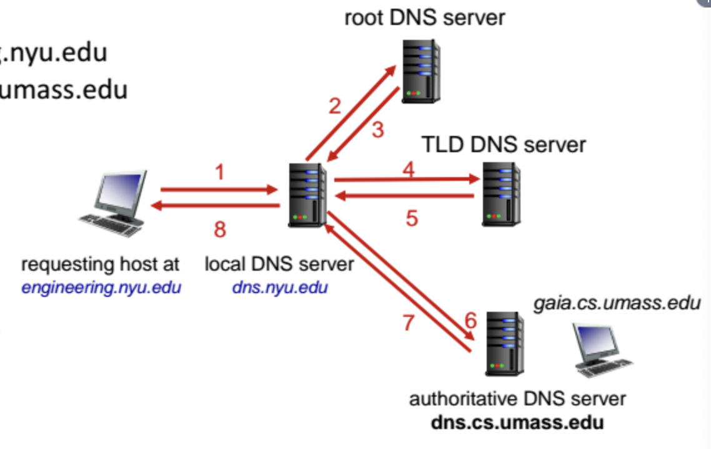
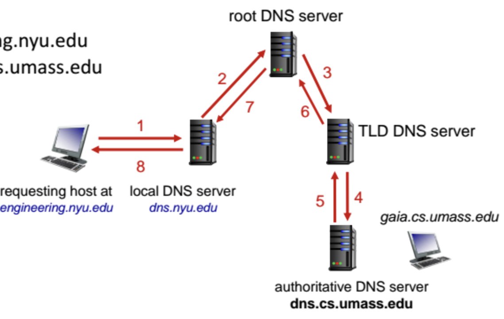

# 웹
웹페이지는 웹서버에 저장되는 object(HTML, JPEG, audio...)들로 이루어져 있다. 웹페이지는 base HTML과 추가로 로드해야 하는 외부 리소스들로 이루어져 있다. 외부 리소스들은 각각 URL을 가지고 있다.

웹은 application이다.
웹이 사용하는 application layer protocol은 HTTP이다.
HTTP(hypertext transfer protocol)는

## cs구조이다
  - client: 웹 object들을 request, receive(HTTP이용해), display하는 브라우저
  - server: request받으면 웹 object들을 보내주는(HTTP이용해) 웹 서버

## TCP를 쓴다
TCP(transport layer protocol)

- client가 TCP connection을 시작한다
  - client가 새 TCP 소켓을 만든다
  - client는 임의의 포트를 사용한다.
  - three way handshake - SYN->SYN/ACK->ACK
- server가 TCP connection을 받는다.
  - server는 포트 80을 미리 listen하고 있다.
  - client가 handshake를 시작하면 서버가 accept()해서 새로운 소켓 생성해서 1:1 연결이 만들어진다.
- HTTP message가 브라우저(client)와 웹서버(server)사이 교환된다.
- TCP connection이 닫힌다.

서버가 미리 포트 80에서 listen() 상태로 기다리고 있다는 것은 이미 connection이 만들어져 있다는 뜻이 아니라, 포트 80을 목적지 포트로 하는 SYN을 받을 준비를 하고 있다는 것을 뜻한다. TCP 1:1 연결은 SYN이 오고 accept()가 실행될 때 생성된다.

서버 포트 80은 listen 용이라 서버프로그램이 실행중인동안은 계속 열려있다. 서버는 포트 80 하나만 열어도 수천개의 connection 처리가 가능하다. connection을 구분하는 것은 서버의 포트넘버가 아니고, 클라이언트포트가 다르기 때문이다.

로컬호스트는 무엇인가? 네트워크 장비를 통과하지 않아도 내 컴퓨터가 자신에게 요청을 보낼 수 있는 가상의 인터페이스다. 물리적 네트워크까진 안 가고 커널 내부에서 loopback을 통해 패킷이 왕복한다. 전선과 라우터만 거치지 않을 뿐 tcp/ip를 소프트웨어적으로만 처리하는 네트워크. 기계가 클라이언트인지 서버인지는 기계 자체가 아니라 실행 중인 프로그램의 행동으로 결정된다. 

- ip: 장치 식별 주소
- 포트 번호: 장치 안에서 process(프로그램)을 식별하는 번호. 0-65535
- 소켓: TCP연결을 표현하는 커널 내부 자료구조. 포트x상대방정보(ip,포트)로 식별된다.

ip는 절대적 식별자가 아니라 네트워크가 장치에게 임시로 붙여주는 주소다. 장치가 이동하면 새 네트워크에 접속하고, 그 네트워크가 새로운 ip를 할당한다. 그 ip를 주는 서버를 DHCP라고 하는데 DHCP가어떤 장치를 이미 알고있으면 같은 ip를 다시 준다. reservation-like behavior. 공인ip: 통신사 쓰는 사람끼리 같은 ip를 쓰는 것처럼 보이는데 통신사가 NAT 테이블이라는걸로 번역해서 구분한다고.

레이어... application layer가 '이런 메세지를 보내고 싶어'한다 -> transport layer에서 서버의 이 포트넘버가 listen()중일 거라고 가정하고 그 포트넘버를 붙인다 -> network layer에서 ip를 붙인다 -> 
아 그니까 application layer가 application layer끼리, transport 는 transport끼리, 등등 소통하는게 아니라 application에서 http프로토콜로 메시지를 만들면 transport가 거기 tcp프로토콜 헤더 붙이고 network가 ip 붙이고 link가 어쩌고저쩌고해서(아직안배웠음) physical이 보내면 link가 받아서 뭐 하고 network가 link헤더 떼고 transport가 tcp헤더떼고 application layer이 http헤더떼서 최종 데이터가 application한테 도착하는거?

그래서 같은 레이어라도 클라이언트 특정 레이어에서 하는 일이랑 서버의 특정 레이어에서 하는 일이랑 다르다.

# HTTP connection의 두 타입
HTTP는 stateless다. 서버는 과거의 클라이언트 request를 저장하지 않는다. 복잡하기 때문이다.

## non-persistent
HTTP 1.0
한 번의 TCP connection에 하나의 object만 보낼 수 있다. 그러고 닫힌다.

예시
- 유저가 url을 친다: www.someschool.edu/someDepartment/home.index: 10개의 jpeg 이미지를 reference하고있는 페이지다.
- 클라이언트가 서버 프로세스 www.someschool.edu의 포트80에 tcp initiate한다.
- 서버가 포트80에서 accept하고 클라이언트에게 알린다
- 클라이언트가 tcp socket에 http request message를 보낸다. object someDepartment/home.index를 원한다고.
- 서버가 받아서 response message에 요청된 object를 넣어서 socket에 넣어서 보낸다. tcp connection을 닫는다.
- 클라이언트가 html 파일을 받아서 파싱하니까 10개의 reference된 jpeg object가 보인다.
- 이걸 10번 반복한다.

round trip time(RTT): 패킷이 클라이언트에서 서버로 갔다가 돌아오는 시간.
initiate하려고 RTT, request하려고 RTT 하니까 HTTP response time이 2RTT+파일받는 시간 인거임...

문제
- object마다 2 RTT 필요
- tcp connection마다 os 오버헤드. 오버헤드란 어떤 명령을 처리하는데 소비되는 간접적인 컴퓨터 자원.
- 브라우저는 종종 reference된 object들을 가져오기 위한 복수의 병렬적인 tcp connection을 열어야 한다?

## persistent
HTTP 1.1
하나의 TCP connection에 여러개의 object를 보낼 수 있다.
서버가 response를 보낸 다음에 open인 채로 유지한다 -> 이어서 같은 클라이언트/서버 간 message는 그 connection으로 보낸다.

그러면 클라이언트는 referenced object가 있으면 바로 request보낼 수 있다. -> 모든 referenced object에 RTT한개.

## 이후

- HTTP 2: 비동기적인 http request를 하나의 tcp connection에 보냄, http request는 병렬되고 tcp connection은 재사용됨?

- HTTP 3: UDP

# HTTP request message

- request line
  - method: GET/POST/PUT/DELETE
  - URL: path+query
  - version
- header lines
  - header field name, value
    - host, user-agent, accept, accept-language, accept-encoding, accept-charset, keep-alive, connection 
- cr lf: 헤더의 끝을 나타냄
  - sp: spacebar
  - cr: carriage return (\r)
  - lf: line feed (\n)
- entity body

ASCII(인간이 읽을 수 있는 포맷)으로 적힘.

## request method
- GET: 조회. user data는 url field에 담김.
- POST: 중복으로도 계속 생김. user input은 entity body에 담김.
- PUT: 없는 파일은 새로 생성하고 있는 파일은 완전 교체한다.
- HEAD: GET했을때 받을 header만 요청함?

POST랑 PUT의 차이가 뭔지, POST는 이도저도아닌데 왜있는건지, PATCH는 왜없는지

# HTTP Response message
- status line
  - version
  - status code
- header lines
  - date, server, last-modified, etag, accept-ranges, content-length, keep-alive, connection, content-type
- cr lf
- data

## HTTP Response Status Codes
- 200 OK: 성공
- 301 Moved Permanently: 요청한 object가 옮겨졌음, 새로운 위치 명시됨
- 400 Bad Request: request 메세지 서버가 못알아들음
- 404 Not Found: 요청한 문서 이 서버에 없음
- 505 HTTP Version Not Supported

# cookies
HTTP GET/response는 stateless하다, 서버는 클라이언트의 리퀘스트를 저장하지 않는다. 그래서 웹 거래 하나를 완성하기 위해서 여러개의 HTTP message를 교환한다는 개념은 없다. message 교환의 상태를 추적할 필요가 없다. 모든 HTTP request들은 독립적이다.

거래들 사이의 어떤 상태들을 보존하기 위해 웹사이트와 브라우저는 cookie를 사용한다.

1. HTTP response의 cookie header line
2. 다음 HTTP request의 cookie header line
3. 사용자의 host에 있는 브라우저가 관리하는 cookie 파일.
4. 백엔드 데이터베이스

브라우저로 e-commerce 사이트를 처음 방문한다 -> 첫 http request가 도착하면 site는 unique id와 그 id를 데이터베이스에 넣는다? -> 그 이후의 사용자의 request는 id 값을 저장하고 있어서 site가 그 사용자를 인식할 수 있다.

# web caches
서버를 관련시키지 않고 클라이언트 요청 처리하기

자주 불러오는 정보를 cache(프록시 서버)에 올려놓는다. 브라우저는 모든 HTTP request를 서버가 아닌 cache에 보낸다. cache에 object가 있으면 그거 쓰고 없으면 cache가 object를 서버에 request해서 cache에 넣고 클라이언트에게 가져옴.

웹캐시는 클라이언트로도, 서버로도 활동한다.
주로 ISP(대학,회사,지역ISP)에서 캐시를(프록시서버를?) 설치한다.

왜 웹캐시를 할까? 클라이언트입장에서는 response가 빠르고(캐시가 더 가까움) 서버입장에서는 트래픽이 분산돼서 좋음. 지역 ISP는 외부 서버로 가는 트래픽을 줄여서 access link 대역폭을 효율적으로 씀?

## conditional GET
캐시-서버 관계에서

캐시가 최신정보를 갖고있으면 object를 보내지 않는다 -> link를 덜 사용, transmission delay없음?

캐시는 HTTP request에 캐시된 사본의 날짜를 명시한다. 그러면 서버가 그 날짜 이후에 바뀌지 않았다면 304 Not Modified를 보낸다.

# HTTP2
목적은 object를 보내는 HTTP request가 여러개 있을때의 지연을 줄이는 것이다.

1.1에서 하나의 TCPconnection에 여러개의 GET을 보낼수 있게 되었다. 그런데 먼저 온 순서대로 처리해 줘야 했다.
바로 앞에있는 메세지가 큰 메세지면 많이 기다려야됨.
= head-of-line(HOL) blocking
-> 버려진 TCP segment를 재전송하느라 object transmission이 속도를 잃는다.

HTTP2는 object를 클라이언트로 보내는 서버에서의 유연성을 늘렸다. 어떻게?
- method, status code, header files는 거의 안 바뀌었다.
- 요청된 object들의 전송 순서를 클라이언트에서 명시한 우선순위에 따르도록 했다.
- object들을 프레임으로 나누고, 프레임을 배정함.

어떻게?

예를 들어 클라이언트가 큰 동영상 1개, 3개의 작은파일을 요청했다고 하면 object를 프레임으로 잘게 나눠서 고르게 보내줌 -> HOL blocking을 완화한다.

# E-mail
- user agent: 사용자가 메일을 다루는 소프트웨어
- mail servers
- SMTP(simple mail transfer protocol)

## user agent
메일 쓰기, 편집, 읽기
보낸/받은 message가 서버에 저장된다

## mail servers
- mailbox: 사용자가 받은 메세지를 담음
- message queue: 전송될 메세지가 쌓임
- SMTP protocol: 메일서버들 사이 메세지 보내는데 사용. 얘도 클라이언트이자 서버.

## SMTP - RFC 5321
TCP를 사용함. UDP썼다가 메일 짤리면 안되니까.
서버가 port 25를 쓴다?
서버에서 서버로 직접 보냄.

단계
- handshaking
- 메세지 줌
- closure

클라이언트는 서버로 command를 보낸다. command는 HTTP의 request line과 비슷하다고 보면 된다.
이에 대해 서버는 status code,phrase로 응답한다.

초기버전은 메세지가 7-bit ASCII(128가지 문자)여야 했음.

단계
1. A가 user agent로 이메일을 작성해서 B bob@someschool.edu에 보낸다.
2. A의 user agent가 A의 서버에 메세지를 보낸다. 메세지는 message queue에 들어간다. (SMTP)
3. 클라이언트가 B의 서버에 TCP connection을 열고 메세지를 보낸다 (SMTP)
4. B의 서버는 메세지를 B의 mailbox에 넣는다.
5. B는 user agent가 메세지를 읽도록 한다. (IMAP,HTTP)

## RFC 2822
메세지 자체의 문법을 명시한다.
SMTP command와는 다르다?

- header
  - To:
  - From:
  - Subject:
- blank line
- body
  - ASCII character만.

SMTP: 메일 전송, 저장
IMAP(internet mail access protocol): 서버에서 메일 가져오기, 삭제.
HTTP: gmail 등은 SMTP, IMAP 위에 웹 인터페이스로 이메일을 가져옴.

# DNS
domain name system

인터넷의 host와 router는 패킷을 어디로 보낼지 지정하는 역할을 하는 32bit의 ip 주소와, 사람이 사용할 name으로 이루어진다.

방대한 데이터라서 계층적으로 관리해야 한다. 전세계에서 다쓰는데 한쪽에 몰리면 안됨.

데이터베이스가 한 곳에 모여있지 않고 여러 서버에 나뉘어 저장되어 있다. 루트, 최상위 도메인(TLD), 권한서버 등의 계층 구조를 가진다. DNS는 application layer의 프로토콜로 구현되어 있다?

## DNS services
- hostname을 ip주소로 번역한다
- host aliasing: 공식적인 alias name들
- 메일서버 aliasing
- load distribution: 하나의 도메인 name에 여러 ip를 대응시킴 -> 트래픽을 분산시킨다.
  - 사용자가 많으면 한 서버(한 ip)만으로는 느려진다. -> 복제서버. 동일한 웹사이트를 여러 서버에 복제하면 각각 고유한 ip주소를 가진다. -> dns는 도메인 이름을 여러 ip주소에 매핑하기 때문에 클라이언트가 접속할 때마다 dns가 순환 같은 정책으로 ip를 반환한다.

## hierarchy
- root
- top level domain: .com, .org, .edu
- authoritative: amazon.com, umass.edu

클라이언트가 .com DNS서버를 찾으려고 root 서버를 쿼리한다
-> 클라이언트가 amazon.com DNS서버를 찾으려고 .com DNS서버를 쿼리한다
-> 클라이언트가 www.amazon.com의 ip주소를 찾으려고 amazon.com DNS서버를 쿼리한다.

### Root Name Servers
이름을 못찾겠는 이름서버가 마지막으로 찾는 서버? 뭔소리지

인터넷에서 엄청나게 중요함
DNSSEC: 보안제공.
ICANN: root dns 관리함

### Top-Level Domain
모든 탑레벨 도메인

### Authoritative server
기관의 DNS 서버. 권한 hostname을 부여. 그 기관의 host들을 위해. 기관에서관리될수있음.

# Local DNS Name Server
hierarchy에 반드시 포함되지는 않는다.
ISP들이 하나씩 가지고 있다. default name server
dns.nyu.edu

host가 DNS쿼리 치면 local DNS 서버로 간다. name을 주소로 바꿔주는 번역기의 캐시를 가지고있다. 가끔 out of date. 프록시서버같은 역할.

## dns name resolution
engineering.nyu.edu의 host가 gaia.cs.umass.edu의 ip주소를 원한다고 치자. local DNS 서버가 

iterated query는 local DNS 서버가 컨택할 서버의 name으로 답변한다. 이 서버한테 물어보라고. 그럼 root갔다 tld갔다 authoritative서버가서알아냄

- recursive query: 컨택한 name server에 책임을 맡김.

## dns 정보 캐시하기
name server가 매핑을 알게되면 그것을 캐시한다. 그리고 즉시 캐시된 것을 리턴한다.
- 캐싱은 response time을 개선
- TTL: 캐시를 얼마나 오래 저장할건지
- tld 서버가 주로 local name server에 캐시된다.

이름이있는 host가 ip주소를 바꾸면 모든 TTL이 만료되기까지 인터넷은 그걸 모른다.

## dns records
타입에 따라 저장하는 정보가 다르다.
RR format: name, value, type, ttl

- A
  - name: hostname
  - value: ip주소
- NS
  - name: domain
  - value: hostname of authoritative name server
- CNAME
  - name: alias name
  - value: name
- MX
  - value: name of mailserver

## dns protocol and messages
dns는 메세지를 query하고 reply한다. 둘다 포맷이 똑같다.
- header
  - identification
    - 16 bit #(query, reply 똑같음)
  - flags
    - recursion desired
    - recursion available
    - reply is authoritative
- 

??

## dns security
- ddos 공격
  - root server 타겟
    - date
    - 트래픽 필터링
    - local dns server의 캐시작용
  - tld server타겟
    - 좀더 위험함

- redirect 공격
  - dns 쿼리를 가로챔
  - 가짜를 dns에넣음
- ??