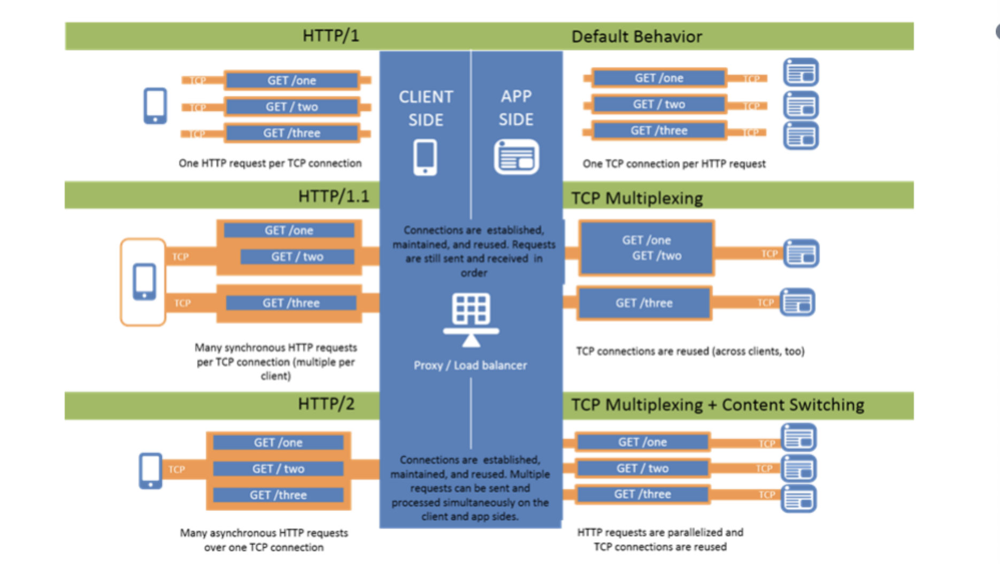
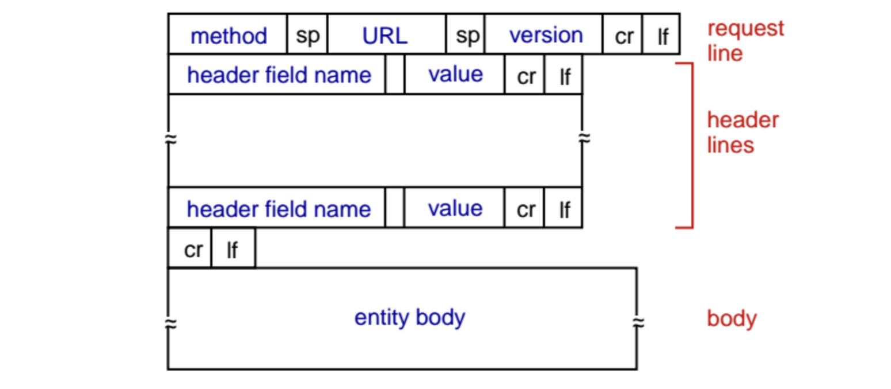
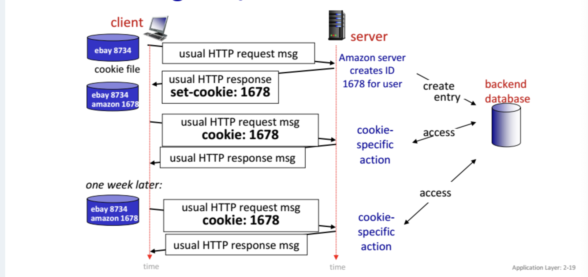

# Application-Layer Protocol
정의해야 하는 것.
- message type: request인지 response인지
- message type의 문법: field
- field의 의미론
- 언제 어떻게 process가 message를 전송하고 응답하는지.

브라우저가 RFC HTTP의 규칙을 따르면 그 규칙을 따르는 모든 웹서버에게서 웹페이지를 가져올 수 있다. -> public domain.

가장 중요한 application들
- 웹
- 이메일
- DNS: 유저가 직접하는게 아니라 웹,이메일같은 다른 application을 이용해 간접적으로 씀.
- 비디오스트리밍
- P2P


# HTTP
> 이론적 특징들. stateless
hypertext transfer protocol
웹의 application-layer protocol이다. 서로 다른 end system에서 실행되고 http message를 교환해 소통하는 클라이언트와 서버프로그램으로 구현된다.

# 웹
웹페이지는 웹서버에 저장되는 object(HTML, JPEG, js, css, audio...)들로 이루어져 있다. object들은 url로 찾을 수 있다. 웹페이지는 base HTML과 reference된 다른 object들로 이루어져 있다.

url은 두 파트로 이루어졌다
- 서버의 hostname: www.someschool.edu
- object의 path name: /somedept/picture.gif

## cs구조이다
- client: object들을 request, receive, display하는 브라우저
- server: object들을 가지고 있다가 request받으면 보내줌.
  - 유명한 server application으로 apache가 있다. `TBD`

# HTTP와 TCP
- HTTP와 TCP의 역할분담은 매우 바람직함.
- HTTP는 stateless다. 서버는 과거의 클라이언트 request를 저장하지 않는다.

## non-persistent (HTTP 1.0)
> 버전간 차이점 설명.
> 1.0-1.1 RTT문제 개념
한 번의 TCP connection에 하나의 object만 보낼 수 있다.

예시
- 유저가 url을 친다: www.someschool.edu/someDepartment/home.index: 10개의 jpeg 이미지를 reference하고있는 페이지다.
- 클라이언트가 서버 프로세스 www.someschool.edu의 포트80에 tcp connection initiate한다.
- 서버가 포트80에서 accept하고 클라이언트에게 알린다
- 클라이언트가 tcp socket에 http request message를 보낸다. object someDepartment/home.index를 원한다고.
- 서버가 받아서 response message에 요청된 object를 넣어서 socket에 넣어서 보낸다.
- 서버 process가 tcp에게 tcp connection을 닫으라고 한다.
- 클라이언트가 html 파일을 받는다. tcp connection이 닫힌다. 클라이언트가 파싱하니까 10개의 reference된 jpeg object가 보인다.
- 이걸 10번 반복한다.
-> 총 11번의 TCP connection 생성

round trip time(RTT): 패킷이 클라이언트에서 서버로 갔다가 돌아오는 시간.
한 번의 TCP connection에서
- c->s syn
- s->c ack             // 1 RTT
- c->s ack + request
- s->c response(delay) // 2 RTT
-> 2RTT + delay

문제
- TCP connection여는데 buffer할당, variable 저장 등 클라이언트 많은 서버한테 힘들음.
- object마다 2 RTT 필요

## persistent (HTTP 1.1)
하나의 TCP connection에 여러개의 object를 보낼 수 있다.

서버가 response를 보낸 다음에 connection을 유지한다 -> 이어서 같은 클라이언트/서버 간 message는 그 connection으로 보낸다. 그래서 웹페이지 하나를 한 connection으로 보낼 수 있다.

그리고 같은 서버에 있는 여러개의 웹페이지를 하나의 connection으로 같은 클라이언트에게 보낼 수 있다.

일정 시간동안 사용안되면 connection 닫음. 설정가능.



`TBD`


# HTTP request message


```bash
GET /somedir/page.html HTTP/1.1
Host: www.someschool.edu
Connection: close
User-agent: Mozilla/5.0
Accept-language: fr
```

request line
- method: GET/POST/PUT/DELETE
- URL: path+query
- version

header lines
- host: 웹프록시서버에서 씀.
- connection: persistent할건지 close할건지
- user-agent: 브라우저 타입
- accept, accept-language, accept-encoding, accept-charset, keep-alive, ...

- cr(\r) lf(\n): 헤더의 끝을 나타냄
- entity body
  - GET일 때는 empty, POST일때 유저가 쓴 것이 저장됨.
  - 하지만 폼을 사용한 request가 항상 POST일 필요는 없다. url에 요청을 담아서 GET할 수도 있다.

ASCII(인간이 읽을 수 있는 포맷)으로 적힘.

## request method
> 메소드 구분
- GET: 조회. user data는 url field에 담김.
- POST: 중복으로도 계속 생김. user input은 entity body에 담김.
- PUT: 없는 파일은 새로 생성하고 있는 파일은 완전 교체한다.
- HEAD: GET했을때 받을 header만 요청함?

# HTTP Response message
```bash
HTTP/1.1 200 OK
Connection: close
Date: Tue, 18 Aug 2015 15:44:04 GMT
Server: Apache/2.2.3 (CentOS)
Last-Modified: Tue, 18 Aug 2015 15:11:03 GMT
Content-Length: 6821
Content-Type: text/html
```
status line
- version
- status code
- status message

header lines
- connection: 닫을 것인지
- Date: HTTP response가 만들어지고 전송된 시각
- server: user-agent와 비슷.
- last-modified: object의 생성이나 수정된 시각. 캐싱에 중요.
- content-length: objectdml byte 수
- content-type: object의 타입을 공식적으로 명시(file extension아님)
- etag, accept-ranges, keep-alive, ...

- cr(\r) lf(\n)
- entity body
  - 요청된 object

## HTTP Response Status Codes
- 200 OK: 성공
- 301 Moved Permanently: 요청한 object가 옮겨졌음, 새로운 url이 Location: 에 명시됨
- 400 Bad Request: request 메세지 서버가 못알아들음
- 404 Not Found: 요청한 문서 이 서버에 없음
- 505 HTTP Version Not Supported: 서버가 요청된 http version 지원하지 않음.


# 유저와 서버의 상호작용: Cookies
> 쿠키, 세션 구분
HTTP 서버는 stateless하다.
그래서 웹 거래 하나를 완성하기 위해서 여러개의 HTTP message를 교환한다는 개념은 없다. message 교환의 상태를 추적할 필요가 없다. 모든 HTTP request들은 독립적이다.

하지만 웹사이트가 유저를 인식하면 좋겠을때가 있다. 유저를 차단하고 싶을때나 유저에 맞는 콘텐츠를 제공하고 싶을 때. 그러기 위해서 cookies를 쓴다.



1. 어떤 서버에 처음 http request를 한다
2. 서버가 id를 만들어서 데이터베이스에 넣고 Set-cookie:1678을 response에 넣어 보낸다
3. 브라우저가 cookie file에 id랑 hostname을 저장한다
4. 그 이후 클라이언트는 항상 cookie: 1678을 request에 넣어 보낸다
5. 서버가 id를가지고 데이터베이스 봐서 cookie-specific한 action을 한다.

그 cookie를 session동안 보관하는건가? session은 뭐지 `TBD`


# Web Caching
> 웹캐시 두는 이유 유ㅓ저관점 프로그ㅐㄹㅁ 관점에서
웹캐시란? 클라이언트들의 request들을 원래 웹서버를 대신하여 만족시켜 주는 프록시 서버를 두는 것이다.

웹캐시는 자기 disk를 가지고 있어서 최근에 request된 object의 복사본을 저장해 둔다.

브라우저는 모든 request를 웹캐시에 보낸다.
1. 브라우저가 웹캐시에 TCP connection을 만들고 request를 보낸다
2. 웹캐시에 그 object가 있으면 그거 response로 보내고
3. 없으면 웹캐시가 원래 서버에 TCP connection을 열어서 그 object를 받는다
4. 받은 object를 지 스토리지에 복사해서 저장한 다음 클라이언트와 열려있는 connection에다가도 보내준다.

그래서 웹캐시는 동시에 클라이언트로도, 서버로도 활동한다.
주로 ISP에서 캐시를 설치하고 브라우저를 설정해놓는다.

왜 웹캐시를 할까?
- 클라이언트 입장에서는 response가 빠르다. 클라이언트와 웹캐시와의 대역폭을 크게할수있으니까.
- 서버 입장에서는 자기한테 일 덜 오니까 좋음
- ISP 입장에서는 외부 서버로 가는 트래픽을 줄여서 access link 대역폭 사용량을 절감할 수 있음.
- 트래픽을 낮추니까 그냥 인터넷에도 좋음.

`TBD` 이거 웹캐시 안썼을때랑 썼을때 딜레이 비교하란문제는 안나오겠지..?


## CDN (Content Distribution Network)
cdn 회사들이 여기저기에 캐시를 많이 설치해놔서 트래픽을 많이 지역화했음. 공용/전용 cdn이 있음.

## conditional GET
웹캐시가 object를 저장한 후에 서버에서 object가 수정되었을 수 있음. 옛날 버전을 가지고 있을수도 있다. 그래서 http에는 캐시가 자기 object가 최신인지 확인할수있게 하는 방법 conditional GET이 있다.

conditional GET request message는 헤더라인에 `If-Modified-Since:` 가 있음.


1. 클라이언트의 request가 와서 웹캐시가 웹서버한테 request한다.
2. 웹서버가 object를 웹캐시한테 준다.
3. 웹캐시가 object를 자기스토리지에 저장할 때 last-modified를 같이 저장한다.
4. 다음번에 웹캐시가 같은 object 요청을 받으면 웹서버한테 conditionalGET을 때린다. `If-modified-since:` 에다 `last-modified:`를 붙여서.
5. 서버는 그 날짜 이후에 바뀌지 않았다면 304 Not Modified를 empty entity body로 보낸다.


# HTTP2
> 왜좋은지. HOL문제때문임.
목적은 object를 보내는 HTTP request가 여러개 있을때의 지연을 줄이는 것이다.

1.1 persistent TCP에서 하나의 connection에 여러개의 GET을 보낼수 있게 되었다. 그런데 오는 순서대로 처리해야 해서 앞쪽 object가 크면 많이 기다려야됨.
=> head-of-line(HOL) blocking

1.1에서는 이걸 parallel TCP열수있게 해서 해결하려했는데 이걸 대역폭많이쓰려고 브라우저들이 남용함.

그래서 웹페이지당 TCP connection 한개 쓰되 HOL blocking을 없애기 위해 Framing을 도입했다.

Framing: frame 단위로 잘게 쪼개서 object들을 돌아가며 보내주고 나중에 다시 조립함. `TBD`


# E-mail
- user agent
  - 메일 쓰기, 편집, 읽기
  - 보낸/받은 message를 서버에 저장
- mail servers
  - outgoing message queue: 전송될 메세지가 쌓임
  - mailbox: 사용자가 받은 메세지를 담음
- SMTP(simple mail transfer protocol)

받는사람 mailserver가 문제있어서 못받으면 보내는사람 message queue에 들어있다가 나중에 보냄. 30분마다 재전송하고 안되면 보내는사람한테 알림.

## SMTP - RFC 5321
- 메일서버들 사이 메세지 보내는데 사용. 클라이언트/서버
- TCP 씀
- 초기버전은 메세지가 7-bit ASCII(128가지 문자)여야 했음. 근데 멀티미디어 보내야하니까 인코딩 디코딩 과정 추가됨.

단계
> 과정. 어떤프로토콜쓰는지.
1. A가 user agent로 이메일을 작성해서 B 서버(메일주소명시) 포트25에 보낸다.
2. A의 user agent가 A의 서버 message queue로 보냄 (SMTP 또는 HTTP)
3. A서버가 B의 서버에 TCP connection을 열고 handshaking 하고 메세지를 보낸다 (SMTP)
4. B의 서버는 메세지를 받아서 B의 mailbox에 넣는다. 더 보낼거없으면 connection 닫는다.
5. B는 user agent가 메세지를 읽도록 한다. (IMAP 또는 HTTP)

프로토콜 예시 `WTF`

command: ASCII 텍스트
- HELO, MAIL FROM, RCPT TO, DATA, QUIT
- .는 메세지가 끝났음을 알림
response: status code, phrase

## Mail Message Formats
- 메일 헤더
  - From: alice@crepes.fr
  - To: bob@hamburger.edu
  - Subject: Searching for the meaning of life.
- 한줄비우기
- body

근데 이거랑 SMTP protocol이랑 무슨관계지? 이건 protocol은 아닌가?


## Mail Access Protocol
만약 메일서버가 그사람의 pc라면 맨날 켜져있어야할것임. 그래서 다른 유저들이랑 공유된 항상 켜진 메일서버를 사용함.

SMTP는 전송하는거 용도라서 가져오는거는 다른프로토콜 써야함. 만약 웹이나 폰 앱으로 이메일을 쓰고있다면 user agent는 HTTP를 쓸거고, microsoft outlook같은 메일클라이언트는 IMAP이라는걸 씀. 둘다 메일 관리하는데 쓰임.


# DNS (domain name system)
> DNS 계층적 구조 이해.
인터넷의 디렉토리 서비스.

인터넷의 host와 router는 패킷을 어디로 보낼지 지정하는 역할을 하는 32bit(4byte)의 ip 주소와, 사람이 사용할 name으로 이루어진다. `121.7.106.83` ip 주소는 점이 byte마다 분리하고 각 byte는 0-255이다.

위계적으로 한 이유는
- 왼쪽에서 오른쪽으로 읽으면 점점 구체적인 정보를 얻을 수 있다.
- 방대한 데이터라서 계층적으로 관리해야 한다. 전세계에서 다쓰는데 한쪽에 몰리면 안됨.

## DNS가 하는 일: hostname -> ip
hostname을 ip주소로 번역한다. DNS는
- DNS 서버의 위계로 구현된 분산된 데이터베이스이자,
- host들이 분산된 데이터베이스를 쿼리할 수 있게 해주는 application-layer protocol이다.

host가 ip주소를 알아내는 과정
1. 사용자의 기계가? `WTF` DNS application의 클라이언트를 실행한다.
2. 브라우저가 url에서 hostname을 뽑아내서 DNS 클라이언트에게 패스한다
3. DNS 클라이언트가 hostname을 포함한 쿼리를 DNS 서버한테 전송한다
4. DNS 클라이언트가 ip주소를 받는다
5. 브라우저가 ip주소를 받아서 그 서버의 포트80에 TCP connection을 initiate할 수 있다.

이래가지고 delay를 추가할거같지만? ip주소는 근처의 dns 서버에 캐시되어 있어서 괜찮다.

DNS 쿼리는 UDP, 포트53씀.

## DNS가 하는 다른 일
- host aliasing: canonical/alias hostname을 둘 수 있다.
- 메일서버 aliasing
- load distribution: 하나의 도메인 name에 여러 ip를 대응시킴 -> 트래픽을 분산시킨다.
  - 사용자가 많으면 한 서버(한 ip)만으로는 느려진다. -> 복제서버. 동일한 웹사이트를 여러 서버에 복제하면 각각 고유한 ip주소를 가진다. -> dns는 도메인 이름을 여러 ip주소에 매핑하기 때문에 클라이언트가 접속할 때마다 dns가 순환 같은 정책으로 ip를 반환한다.

## DNS 서버가 위계적이고 분산된 이유
데이터베이스가 여러 서버에 나뉘어 위계적이고 전세계에 분산되어 저장되어 있다.

만약 DNS서버가 하나라면?
- 그거 망하면 인터넷망함
- 하나가 모든 DNS쿼리(전세계host의 http,이메일)를 처리...불가능
- 거리가 너무 먼 곳 존재
- 데이터베이스가엄청커야하고 엄청자주업데이트되어야함...불가능

DNS서버의 종류
- 루트
- TLD(최상위 도메인): .com, .org, .edu
- 권한: amazon.com, umass.edu

과정
1. 클라이언트는 www.amazon.com의 ip주소를 찾고싶다.
2. root 서버를 쿼리 -> .com TLD서버의 ip주소 받음
3. .com 서버를 쿼리 -> amazon.com 권한서버의 ip주소 받음.
4. amazon.com 권한서버 쿼리 -> www.amazon.com의 ip주소 받음.

> iterative, recursive쿼리 뭔지

### 루트서버
1000개의 루트서버가 전세계에 분포되어 있다. 그것들은 12개의 서로 다른 기관들이 관리하는 13개의 서로 다른 루트서버의 복사본이다.

TLD서버의 ip주소를 제공한다.

### TLD서버
모든 탑레벨 도메인, 국가 TLD, 등. 회사들이 하나씩 관리함.

### 권한서버
기관의 DNS 서버. 권한 hostname을 부여. TLD서버에 저장되기 위해 돈을 내야함.


# Local DNS Server
hierarchy에 반드시 포함되지는 않는다.
ISP들이 하나씩 가지고 있다. default name server

host가 DNS쿼리 치면 바로 루트서버로가는게 아니라 로컬DNS 서버로 간다. 프록시서버같은 역할을 함. DHCP `WTF`

TLD서버는 사실 모든 권한서버를 알고있지 않다. 권한서버들을 알고있는 중간 dns서버를 알고있을뿐. 그게 local dns server인가? `WTF`

- PC -> 로컬dns서버 = 재귀
  - 로컬dns가 알아서 발품 팔아서 찾아줌.
- 로컬dns서버 -> 루트/TLD/권한 서버 = 반복
  - 다음주소만 알려주고 직접 알아봐주지 않음.

보통 저 방식으로 함.
근데 한번에 dns메세지가 너무많이 전송된.

그래서 메세지 수 줄이기위해 DNS 캐싱이 많이 사용됨.
로컬dns서버가 reply를 받았을때(hostname-ip매핑) 메모리에 캐시해두는 것임. 그래서 같은 hostname 쿼리 받으면 바로 줄 수 있음.

한 2일정도 되면 캐시 버림.


# dns records
`WTF` RR이 dns캐시의 포맷인건가?
DNS서버는 RR (Resource Records)를 저장한다.
각각의 dns reply messages는 RR을 한 개 이상 갖는다.

4-tuple (Name, Value, Type, TTL)
- TTL은 RR가 캐시에서 지워질지 결정한다.
- Name과 Value의 의미는 Type에 따라 다르다.

Type = A
- Name은 hostname
- Value는 ip주소
-> type A record는 표준 맵핑이다. (ralay.bar.foo.com, 145.37.93.126, A)

Type = NS
- Name은 도메인
- Value는 권한서버의 hostname (foo.com, dns.foo.com, NS)

Type = CNAME
- Name은 alias hostname
- Value는 공식 hostname (foo.com, relay.bar.foo.com, CNAME)

Type = MX
- Name은 alias hostname
- Value는 메일서버의 공식 hostname (foo.com, mail.bar.foo.com, MX)

hostname을 가지고있는 권한서버라면 A 레코드를 캐시에 저장할거고
권한서버가 아니라면 hostname을 가진 도메인의 NS 레코드를 저장할거고..그렇다
`TBD`


## dns 메세지 포맷
dns 메세지는 쿼리와 reply로 나뉘고 둘의 포맷은 똑같다.

- header (12bytes)
  - identification(16 bit): 쿼리를 구분하는.reply메세지에도 담겨서 클라이언트가 구분할 수 있게 한다.
  - flags (각각 1 bit)
    - query/reply flag: 쿼리(0)인지 reply(1)인지
    - authoritative flag: reply에서 dns서버가 권한서버인지
    - recursion desired: 쿼리에서, 받는 dns서버가 recursion을 하기를 원하는지.
    - recursion available: reply에서, recursion이 가능한지
  - number-of 필드 4개: 4개의 데이터 섹션의 발생 숫자?`WTF`
    - questions: 쿼리에 대한 정보. name, type
    - answers: reply에서, 요청된 RR들.(복제된웹서버도있으니까 여러개일수도있음)
    - authority: 다른 권한서버들의 record
    - additional information: 공식 hostname등 유용한 정보.

## DNS 데이터베이스에 레코드 넣기
registrar는 domain name을 dns 데이터베이스에 넣어주는 업체.

1. registrar에게 domain name 등록하기.
2. registrar는 TLD .com 서버에 Type NS와 A 레코드가 입력되게 한다.
아니 근데 권한서버도 모든 hostname 모른다며..?`WTF`
3. Type A, MX(메일서버도 하고싶으면)도 권한서버에 있어야한다.


## dns security
- ddos 공격
  - root server 타겟
    - date
    - 트래픽 필터링
    - local dns server의 캐시작용
  - tld server타겟
    - 좀더 위험함

- man in the middle공격: 쿼리가로채서 가짜reply
