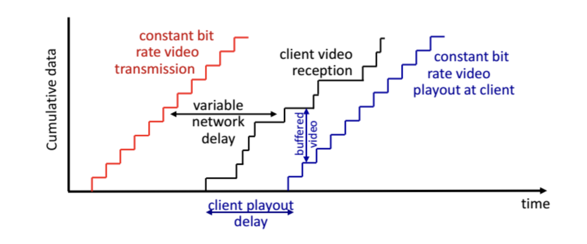
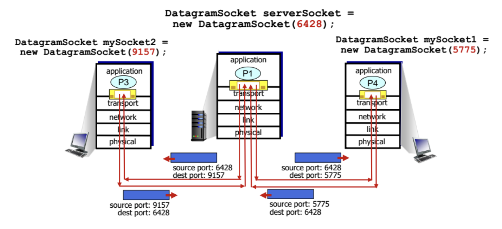
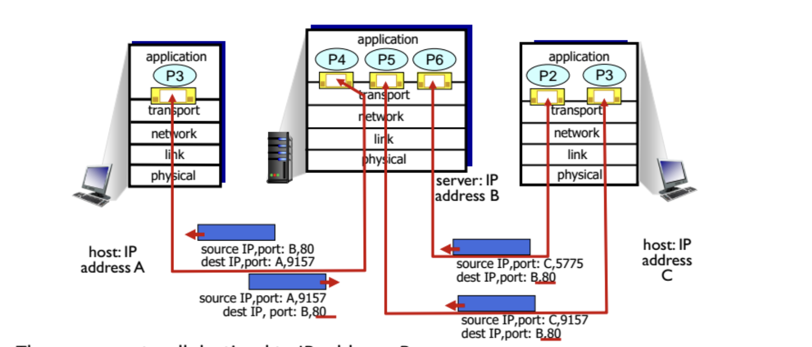

# P2P 구조
항상 돌아가는 서버가 없다. 임의의 end system들이 직접적으로 소통한다.
peer는 클라이언트인 동시에 서버다. self scalability.
peer는 간헐적으로 연결되고 ip주소가 바뀐다.

- cs구조에서는 클라이언트 숫자가 많아질수록 소요시간이 많아진다.
  - N명이 F의 복사본을 원할 때, u는 업로드rate d는 다운로드 `rate D >= max{NF/u, F/d}`
- P2P에서는 클라이언트숫자에 상관없다.
  - 서버는 복사본 하나만 전송한다. `D >= max{F/u, F/d, NF/(u+Eu)}`?

## BitTorrent
파일 공유하면 256kb의 청크 단위로 쪼개서 서로 주고받음. 나중에 받아서 assemble. 내 주변 peer들 중 가장 빠르게 줄 수 있는 곳으로부터 받음.

tracker: 참여하는 peer들을 track한다.
peer가 들어오면 처음에는 chunk가 없다. 다른사람거 다운로드하면 그 chunk를 업로드할 수 있게 됨.

churn: 왔다갔다가 자유롭다. peer가 파일을 받으면 먹튀하거나 남아있을수있음.

- chunk 요청하기: peer들은 서로 다른 chunk의 subset을 가지고있다. -> 사용자는 peer들에게 그들이 가진 chunk의 리스트를 요청한다. -> missing chunk를 peer에게 요청한다.
- chunk 전송하기(tit-for-tat):
  - 사용자가 자신에게 chunk를 가장 높은 rate로 보내고 있는 top4 peer에게 chunk를 보낸다. 나머지는 choke(차단)된다. top4는 10초마다 갱신된다.
  - 30초마다 다른 peer를 선택해서 chunk를 보내기 시작한다. (optimistically unchoke)
  - 그렇게 가장 파일을 빠르게 주는 파트너를 얻음


# Video streaming과 CDN: context
비디오 스트리밍은 인터넷 대역폭의 주된 소비자다.

문제
- scale: 너무 사용자가 많다. 단 하나의 커다란 서버는 안된다.?
- 이질성: 유저들이 서로 다른 환경을 가짐. wired/mobile, 대역폭 크거나 작음
-> 대안: 분산된, application-level 인프라

## video encoding
비디오는 일정한 시간마다 보여지는 이미지의 연속이다.
이미지는 픽셀의 배열이다.
픽셀은 bits의 배열이다.

중복을 이용한다
- 이미지 내에서 spatial coding: 같은 색이 N개 있으면 색의 값과 N을 보냄.
- 이미지 사이 temporal coding: 아예 새로운 프레임을 보내는 것이 아닌 전 프레임과의 difference만 보냄.

서버에서 클라이언트까지 가는데(예를들어 video server -> network core -> access network -> end system) 대역폭이 계속 바뀔것임. congestion level에 따라서. packet loss와 delay는 재생할때 지연되거나 퀄리티를 깨뜨릴 것임

## 어려운 점
1. playout을 잘 맞춰야 한다: playout은 도착한 패킷을 언제 재생할지 결정하는 것, 지연(jitter)를 고려해 버퍼에서 꺼내는 시점을 조절하는 것, 원래 영상이 가진 시간에 맞춰 출력하는 것이다.

2. 클라이언트의 정지, 빨리감기, 되감기, 점프 등 상호작용
3. packet이 버려지고 재전송될 수 있음

## playout buffering


client-side buffering과 playout delay로 네트워크 지연을 보상함.
비디오를 일정한 속도로 전송 -> (네트워크 지연) -> 일정하지 않은 속도로 클라이언트에서 받음 -> (buffer) -> playout은 일정하게
지금 속도가 좋다면 나중에 안될때를 생각해서 미리 받아둠.

## DASH(Dynamic Adaptive Streaming over HTTP)
- 서버: 비디오를 chunk로 나눔. chunk는 일정하지 않은 속도로 저장되고, encode됨.
  - manifest file: chunk들에 url을 부여함.
- 클라이언트: 주기적으로 서버-클라이언트 대역폭 픅정 -> manifest를 찾아서 chunk 하나씩 request함. 이때 다음 세 가지를 클라이언트에서 결정할 수 있음.
  - encoding rate: 현재 대역폭에서 최대한의 지속가능한 rate를 선택함. 서버 속도가 느려지면 내 속도를 낮춤
  - 언제 chunk를 요청할지: buffer가 마르거나 너무 많지 않게
  - 어느 서버에 chunk를 요청할지: 가깝거나 대역폭 높은 url 서버에서 요청

## CDN(Content Distribution Network)
CDN 노트에 콘텐츠의 복사본을 저장한다.
구독자가 CDN에 콘텐츠를 요청한다. 가까운 곳에서 가져옴. 네트워크가 몰릴 때는 다른 곳에서 가져올수도.

넷플릭스의 경우: 사용자가 넷플릭스 비디오를 검색한다, amazon cloud가 CDN서버들에 사본을 여러개 업로드해둔다 -> 사용자가 요청한 특정 비디오의 manifest 파일을 amazon cloud가 준다 -> CDN 서버가 선택되고, contact되고, 스트리밍이 시작된다.


# Socket Programming
목표: socket을 이용해 소통하는 클라이언트/서버 application을 만드는 법을 배우자.

application은 앱 개발자가 제어, transport이하 부분은 os가 제어
socket은 application process와 end-end-transport protocol 사이의 문이다.

transport 는 라우터 같은거 말고 두 단말끼리의 통신만 책임진다. process와 process의 소통.

타입
- UDP: unreliable datagram
- TCP: reliable, byte stream-oriented(connection-oriented)


# socket with UDP
- 클라이언트와 서버 사이 점유하는 connection이 없다. handshaking이 없다.
- sender는 각 패킷에 도착 ip주소와 포트넘버를 붙인다.
- receiver는 받은 패킷에서 sender ip주소와 포트넘버를 추출한다.?
- application의 시각에서: UDP는 byte의 그룹(datagram)을 unreliable하게 전달한다.
  - 데이터를 잃어버리거나 순서가 바뀔 수 있다.

## 클라이언트/서버 상호작용
- 클라이언트가 socket 만들음 `clientSocket = socket(AF_INET, SOCK_DGRAM)`
- 서버가 socket 만들음 `serverSocket = socket(AF_INET, SOCK_DGRAM)`
- 클라이언트가 서버의 ip와 포트넘버와 함께 datagram을 만들어 `clientSocket`을 통해 전송
- 서버가 `serverSocket`에서 datagram을 받음
- 서버가 `serverSocket`에 클라이언트 ip주소와 포트넘버와 함께 응답을 작성
- 클라이언트가 `clientSocket`에서 datagram 읽음
- 클라이언트가 `clientSocket` 닫음.

### UDP 클라이언트 예시
```py
from socket import *
serverName = 'hostname'
serverPort = 12000

clientSocket = socket(AF_INET, SOCK_DGRAM)
message = raw_input('Input lowercase sentence:')
clientSocket.sendto(message.encode(), (serverName, serverPort))

modifiedMessage, serverAddress = clientSocket.recvfrom(2048)
print modifiedMesssage.decode()
clientSocket.close()
```

### UDP 서버 예시
```py
from socket import *
serverPort = 12000

serverSocket = socket(AF_INET, SOCK_DGRAM)
serverSocket.bind(('', serverPort)) # 로컬포트넘버 12000에 socket을 bind한다
print("The server is ready to receive")

while True:
  message, clientAddress = serverSocket.recvfrom(2048)
  modifiedMessage = message.decode().upper()
  serverSocket.sendto(modifiedMessage.encode(), clientAddress)
```

- 왜 서버소켓을 안닫지? -> 서버는 항상 열려있어야 함, 프로세스 종료하면 os가 자동으로 소켓 회수해서 close 안필요함.
- 왜 bind에 ''라고 돼있지? -> '' = 0.0.0.0
  - 0.0.0.0는 모든 인터페이스를 뜻함. 로컬이나 특정 NIC에서만 받는게 아니라.


# socket with TCP
- 서버 process가 먼저 돌아가고 있어야 한다. 서버가 먼저 클라이언트를 받기 위한 socket을 열어놨어야 한다.
- 클라이언트는 socket을 만들 때 서버 프로세스의 ip주소와 포트넘버를 명시한다. = connection을 만든다.
- 서버는 클라이언트에게서 contact당하면 그 특정 클라이언트를 위한 새로운 socket을 만든다. 그래서 서버가 복수의 클라이언트와 소통할 수 있다. 클라이언트를 구분하는데 source 포트넘버를 쓴다.

## 클라이언트/서버 상호작용
- 서버가 request를 받기위한 socket을 만든다 `serverSocket = socket()`
- 서버가 request를 기다린다 `connectionSocket = serverSocket.accept()`
- 클라이언트가 socket을 만든다 `clientSocket = socket()`
- 클라이언트가 `clientSocket`으로 request를 한다
- 서버가 `connectionSocket`으로 request를 받아서 읽는다
- 서버가 `connectionSocket`에 응답을 작성한다
- 클라이언트가 `clientSocket`에서 응답을 읽는다
- 서버가 `connectionSocket`을, 클라이언트가 `clientSocket`을 닫는다

그러면 connectSocket이 만들어지는 타이밍이...?

### TCP 클라이언트 예시
```py
from socket import *
serverName = 'servername'
serverPort = 12000

clientSocket = socket(AF_INET, SOCK_STREAM)
clientSocket.connect((serverName, serverPort))
sentence = raw_input('Input lowercase sentence:')
clientSocket.send(sentence.encode())

modifiedSentence = clientSocket.recv(1024) # 서버이름과 포트넘버가 필요없음.
print('From Server:', modifiedSentence.decode())
clientSocket.close()
```

### TCP 서버 예시
```py
from socket import *
serverPort = 12000

serverSocket = socket(AF_INET, SOCK_STREAM)
serverSocket.bind('', serverPort)
serverSocket.listen(1)
print('The server is ready to receive')

while True:
  connectionSocket, addr = serverSocket.accept() # accept()로 기다리다가 request 오면 새로운 socket 만들어짐.

  sentence = connectionSocket.recv(1024).decode() # UDP와 달리 서버이름과 포트넘버 필요없음.
  capitalizedSentence = sentence.upper()
  connectionSocket.send(capitalizedSentence.encode())
  connectionSocket.close()
```


# Transport Service와 Protocol
process간의 소통을 책임진다. transport protocol은 end system에서 실행된다.
- sender: application message를 segment로 자른다, network layer로 보낸다.
- receiver: segment를 다시 message로 조립한다, application layer로 보낸다.

TCP 추가 서비스
- congestion control
- flow control
- connection setup

UDP 추가 서비스
- X 지역, 대역폭 보장


# Multiplexing & Demultiplexing
서버 transport에서 일어나는 일. application으로부터 socket을 통해 데이터를 받는다.

- sender - multiplexing: 여러 socket에서 온 데이터를 받아서 transport 헤더를 붙인다
- receiver - demultiplexing: 데이터(datagram, segment)에 있는 header(도착지/출발지 ip주소와 포트넘버 갖고있음)를 사용해서 segment들을 알맞은 socket으로 보낸다

TCP와 UDP의 헤더는 확연히 다름. UDP가 더 단순함.
TCP는 4tuple중에 하나라도 다르면 다시연결을만들음.

## Connectionless Demultiplexing
만들어진 서버의 socket은 포트넘버를 가지고있겠지
UDP socket으로 데이터를 보낼때는 도착지의 ip주소와 포트넘버만 명시.
데이터를 받을 때도 segment에 있는 도착지 포트를 확인해서 그 포트넘버를 가진 socket으로 보내야 하고.


? 그림이상함?

서버가 열린 socket한개로 여러 클라이언트 socket에서 받아서 서버의 출발포트를 명시안해도 됨? 그게아닌거같은데.

## Connection-oriented Demultiplexing
TCP소켓은 4-tuple 필요. 출발지/도착지의 ip주소와 포트넘버.
데이터 받을때 4-tuple이용해 알맞은 socket으로 보내준다.




# UDP(User Datagram Protocol)
최소 기능 제공, 시도는 하지만 성공을 보장하지 않음.
connectionless: handshaking없고 segment들은 서로 독립적으로 처리되고
스트리밍 멀티미디어앱, DNS, SNMP에서 사용됨.
connection이 없어서 RTT 지연 감소
connection state없어서 단순함
헤더 작음

## UDP Segment Header
- length: segment의 bytes(헤더포함)
- checksum: 에러난거는 반영하면 안되니까

## UDP Checksum
에러 체크함
- sender: segment를 16bit integer로 취급, segment content의 addition을 체크섬이라고 함. sender가 체크섬 값을 넣음
- receiver가 받은 segment의 체크섬을 계산함, 체크섬 필드와 같으면 에러없음
 
근데 체크섬값이랑 실제비트랑 뭐가다른건지? UDP에서는 헤더도 깨질수있느거아닝야? 헤더는 안깨지는거라면 헤더에다 값을넣으면안돼?