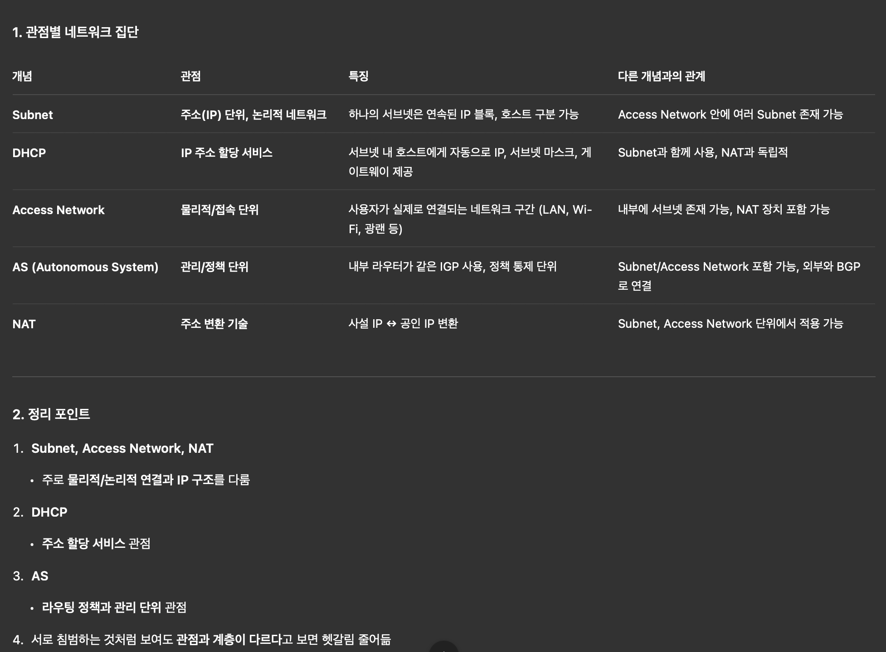

LS algorithm은 거의대부분 다익스트라 알고리즘을 쓰고 DV algorithm은 대부분 bell fordman equation을 쓴다
그리고 AS가 쓰는 실제 라우팅 알고리즘들은 LS 또는 DV중하나를 사용한다

# AS (autonomous system)
모든 라우터가 하나의 라우팅 알고리즘을 실행할 수 없는 이유
- 스케일: 라우터 갯수가 많아질수록 소통,계산,저장해야 하는 정보가 많아진다.
- 자율성: ISP들은 원하는대로 라우터를 동작시키고 싶어한다.

그래서 라우터들을 AS라는 자율적 시스템 안에 넣는 것으로 해결했다. 하나의 AS는 보통 ISP 안에 있는 라우터들과 그것들을 잇는 link들로 구성된다. 어떤 ISP들은 자신의 네트워크를 복수의 AS로 분리하기도 한다(크기비례X). AS들은 ip주소처럼 ASN이라는 숫자로 구분된다.

하나의 AS 안에 있는 라우터들은 같은 intra-AS 라우팅 알고리즘을 실행하고 서로에 대한 정보를 갖고 있다.

- intra-AS routing: AS 내 라우터들의. 내부망을 빠져나오기 위한
- inter-AS routing: AS 간의 라우팅

한 AS 안의 라우터는 gateway router이거나 internal router이다. gateway router는 AS의 'edge'에 있어서, 다른 AS의 라우터와 연결되는 링크를 갖고있다.

- AS안의 목적지: intra-AS 라우팅에 의해 결정
- AS밖의 목적지: inter-AS와 intra-AS 라우팅에 의해 결정(그렇겠지..어쨌든 밖으로나올려면 안에서 gateway라우터로 이동해야 할 거 아니야)

# 아 겁나 헷갈려

[정책/관리 단위 Layer]
AS (Autonomous System)
- 내부 라우터: 같은 IGP 사용 (OSPF, IS-IS, RIP)
- 외부 연결: BGP
- Subnet, Access Network 포함 가능

[물리/접속 단위 Layer]
Access Network
- 사용자가 실제 연결되는 네트워크
- LAN, Wi-Fi, 광랜 구간 등
- 여러 Subnet 포함 가능
- NAT 장치 포함 가능

[주소/IP 단위 Layer]
Subnet
- 연속된 IP 블록 단위
- 각 호스트 IP 구분
- DHCP로 IP 자동 할당 가능
- NAT 뒤에서는 사설 IP + 공인 IP 변환

Access Network 안에 여러 Subnet, Subnet 안에 DHCP, NAT 적용 가능

# intra-AS 프로토콜 (Interior Gateway Protocols IGP)
> 기반이 되는 알고리즘 알기.

- RIP (Routing Information Protocol): DV
- OSPF (Open Shortest Path First): LS
  - IS-IS도 비슷
- IGRP(Interior Gateway Routing Protocol): 시스코 자체 프로토콜(폐쇄 -> 오픈)

## OSPF
- 공개적 프로토콜
- 보안: 모든 OSPF메세지는 authenticated됨
- 계층적임
- LS답게 라우터는 AS전체의 모든 라우터에게 OSPF광고를 쏟아붓는다 -> 각각의 라우터들은 전체 AS에 대한 그래프를 만들음. 자신을 출발 노드로 하여서.

등등.
- 개별 link cost는 네트워크 관리자에 의해 정해짐. OSPF 자체는 link weight을 어떻게 할지에 대한 policy가 없음. 네트워크 관리자의 몫임.
- 라우터들은 자신과 다른 모든 라우터들에 대한 라우팅 정보를 알려준다. link state가 바뀔 때마다. 안 바뀌어도 30분에 한 번씩 방송함.
  
## OSPF의 계층
양이 크면 계층화를 잘 시켜야된다.

- Area: 조직
  - LS에서 하던짓거리(다익스트라알고리즘 돌리기, 시끄럽게중계방송하기)를 하긴 하는데, AS전체에서하는게 아니라 area라는 더 작은그룹내에서만 하는거네.
  - ABR (Area Border Router): 각 area마다 한 개 이상의 ABR. 다른 ABR에게 광고보냄. LS는 Area 밖으로 나갈때는 net 단위로 요약해서 나간다.

=> AS의 gateway router와 비슷한 포지션?이네. 여기선 안과 밖의 라우팅알고리즘/프로토콜이 같지만? 그리고 AS Gateway router는 역할의 본질이 정책 변환이지만 ABR의 역할은 LS 범위제한(스코핑)이다.
LS광고가 area 밖으로 안 나가는 이유: OSPF에 퍼질수있는 범위(area) 내로 묶어주는 뭔가가 내장되어있나봄.

- Backbone Area: Area 0.
  - Area 간 트래픽이 반드시 통과해야 하는 중심. 중심이 있어야하는 이유: Area들이 서로서로 연결되면 한 Area정보가 계속 전파돼서 링크 변화 한번에 모든 Area에서 다익스트라 재실행(끔찍..)
  - Backbone Router: Backbone Area에 속한 모든 라우터. ABR일수도, 아닐수도.

inter-AS는 패킷이 먼저 area border router로 들어가서 backbone을 거쳐 도착지 area의 area border router로 가게 한다.

# inter-AS
> 중요

AS1안의 라우터는 AS1밖으로 나가야하는 데이터그램을 받았다. 이것을 gateway router에게 줘야하지만, 어떤gateway에게?
- 어느 Gateway로나갈지: BGP(inter)
- 그 Gateway까지 어떻게갈지: OSPF(intra)

AS1은 각 destination prefix(subnet)에 대해 가능한 여러 AS경로들을 알고 정책에 따라 하나를 선택해야 한다.
그러기 위해 Gateway router들이 eBGP로 subnet reachability info를 수신 -> AS1 내부라우터에 prefix-gateway 매핑을 iBGP 이용해 퍼뜨린다.

subnet reachability information: 이 IP prefix에 도달하려면 어느 next-hop으로 가야 하는지
next-hop: 이 prefix로 가기 위해 다음에 패킷을 보내야 할 IP 주소. 항상 gateway는 아니다. 즉 AS내부,AS외부 전부 포함한다. 예를들어 eBGP에서의 next-hop은 gateway이고. iBGP에서의 next-hop은 도달해야 할 외부 ip주소이고, IGP에서의 next-hop은 내부라우터이다. 문맥에 따라 next-hop은 달라진다.

BGP테이블은 모든 prefix들을 다 메모리에 유지하고 최적경로를 미리 계산/배포해놓음

# BGP
> iBGP eBGP차이
AS들끼리 소통할때는 하나의 프로토콜이 있어야 한다. BGP (Border Gateway Protocol)가 제일 많이 쓰인다. BGP는 인터넷의 엄청나게 많은 ISP들을 이어붙이는 프로토콜이다.
- decentralized
  - distance-vector
- asynchronous

intra-inter의 기준은 어디서 쓰이는지가 아니라 무슨 목적의 정보를 다루는지이다. intra는 AS 내부 최단경로를, inter는 AS간 경로선택 정책을 다룬다. iBGP는 AS 내부라우터 사이에서 동작하지만 외부 AS에서 온 BGP 메시지(path)를 방송한다. eBGP로 배운 경로를 AS내부에 전파한다. 다른 intra-AS 프로토콜과 하는 일이 다르다.

## BGP session
두 BGP 라우터는 반영구적 TCP connection으로(포트179) BGP 메시지를 주고받는다.
- 이런 connection을 BGP connection이라고 한다. 두 AS 사이의 BGP connection이 eBGP이고, 하나의 AS 안에 있는 라우터들끼리는 iBGP connection이다.
- 메시지는 목적지 prefix로의 path를 광고한다. BGP는 path vector 프로토콜이다.(여기서 path는 지나온 path를 말하는가? 미래는 next-hop밖에 없는가?)

예를 들어
1. AS의 내부라우터가 subnet X가 자기에게 연결돼있음을 IGP로 인지
2. AS의 gateway라우터가 X를 정책에 따라 외부에 알릴지말지 결정 -> eBGP로 prefix X를 광고(이 prefix는 우리 AS를 통해 도달 가능)

## BGP routes
라우터가 BGP connection을 통해 prefix를 광고할 때 BGP attribute 몇개를 같이 광고함.
route: prefix와 그것의 attribute

attribute 2개
- AS-PATH: prefix 광고가 지나간 AS들의 리스트. prefix가 지나갈때 AS는 자신의 ASN을 기존 AS-PATH에 붙인다. 이것은 AS가 이미 자신을 지나간 광고를 거절하는데 쓰인다.
- NEXT-HOP: Next-hop AS로 가기 위한 다음 내부라우터

policy-based routing
- route 광고를 받는 gateway는 path를 허가/거절하기 위해 import policy를 사용한다.
- AS policy는 path를 외부에 광고할지말지 결정한다.

## BGP message
- OPEN: TCP connection을 연다
- UPDATE: 새로운 path를 광고하거나 오래된 것을 취소?한다
- KEEPALIVE: connection 유지
- NOTIFICATION: 이전메시지의 에러 신고, connection 닫기

자자자 다시
- 1a, 1b, 1d는 prefix X로가려면 1c를 거쳐야 함을 iBGP를 통해 알게된다
  - 라우터 1d의 forwarding table에는 (x:138.16.68/22, I:라우터의 interface number) 엔트리가 들어간다.??
- 1d는 1c로 가는 최단거리를 OSPF를 통해 구한다.

## Hot Potato Routing
> 이 뭔지

2d는 X로가려면 2c또는 2a를 거쳐야함을 iBGP를 통해 알게된다.
-> gateway가 2개?
-> hot potato routing

AS 내부에서 AS를 가장 빨리 벗어날 수 있는(least-cost) gateway한테 포워딩하기. 계산을 하지않음.

1. inter-AS 프로토콜에서 subnet x가 여러 gateway를 통해 접근가능함을 알게됨
2. intra-AS 프로토콜에서 각 gateway로 가는 least-cost path를 알게됨
3. Hot Potato Routing: gateway 결정
4. forwarding table (x,I) 사용해 간다.

## BGP route selection
라우터는 목표 AS까지의 라우트를 여러개 알게될 수 있다. 그럼 어떤라우트를 선택?
1. local preference(네트워크 관리자에 의해 정해짐)
2. AS-PATH가 더 짧은
3. hot potato(NEXT-HOP 라우터가 더 가까운)

# SDN
> 킄ㄴ 개념 틀.
기존은 장비에 control plane(라우팅알고리즘), data plane이 있어서 지가다알아서함
근데SDN은 control plane을 중앙 라우팅컨트롤러로 분리, 장치는 받은 flow table로 data plane역할만함.

routing table은 목적지만 보고 결정하지만 flow table은 패킷 속성 전체를 보고 다양한 액션 수행 가능.
table-based forwarding은 라우터를 programming할 수 있게 한다. 트래픽을 두개로나눈다던가..이런 트래픽엔지니어링?도가능해질것. 라우터의 소유권이중요하지않게되고 더 변화가빠르고 앱개발쉽고 등등등...

- northbound API - control plane
- southbound API - data plane
그 사이 SDN controller

## SDN controller
network state정보를 저장하고, control application들 그리고 switch들과 상호작용하고 이것저것 좋은 시스템...
- network control app을 위한 interface layer: network graph, restfull api, ...
- network-wide state management layer: flow tables, link state, switch info, ...
- communication layer: openflow, snmp, ...

## OpenFlow
SDN을 적용한 프로토콜.
컨트롤러가 스위치의 flow table 읽고 씀.

헤더의 flow보고(pattern) drop, forward, modify, send(action) 하기, pattern이 겹치면 우선순위반영(priority), counter

controller와 switch들 사이에서 작동하는 프로토콜. 메시지주고받는데 TCP사용.
openflow message 종류
- controller-to-switch
- switch-to-controller(async)

### controller-to-switch
- feature: 컨트롤러가 switch기능을 쿼리하고 switch가 답장함
- configure: 컨트롤러가 스위치쿼리하고 파라미터 set함
- modify-state: 스위치의 openflow table을 컨트롤러가 add,delete,modify함
- packet-out: ??컨트롤러가 스위치 포트에서 패킷 빼냄?

### switch-to-controller
- packet-in: packet을 컨트롤러에게 준다?(왜 걔한테 주는데) 그리고 컨트롤러의 packet-out 메시지를 본다
- flow-removed: flow table 엔트리를 삭제?
- port status: 컨트롤러에게 포트 변경 알림

예시는 9일차 슬라이드 39페이지쯤에...

# ICMP (internet control message protocol)
> 어떤 내용인지 알게

패킷의 흐름을 관리하는 부가적 프로토콜.
ping: 대상에게 응답이 잘 오는지 health check

# Network management
AS는 엄청많은 컴포넌트들을 가짐, 복잡한 시스템들(비행기,핵공장)도 모니터링이 필요함
- ICMP
- SNMP: 서버에서 라우터가 살아있는지 관리. 체크할때 파싱말고 간단한 프로토콜로 하면됨. 그 라우터의 상태 리스트를 가진 데이터베이스가 MIB(Management information base)

- response/request mode
- trap mode: trap message라는 간단한 메시지

## SNMP protocol
get me
mib 값주기, set하기, 답하기,이벤트알리기