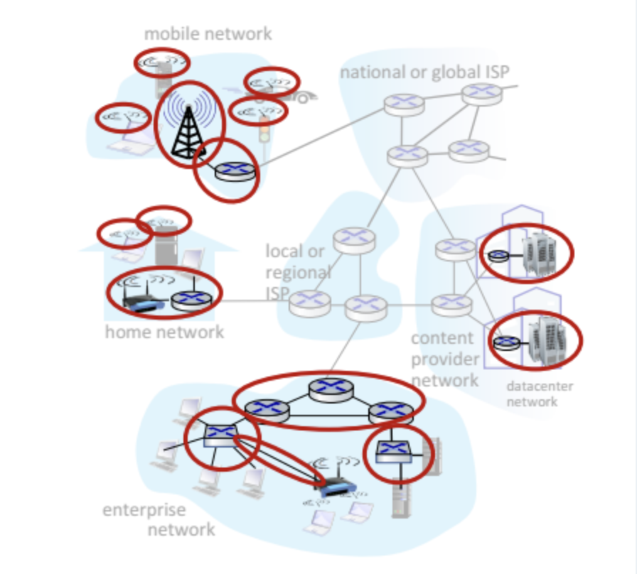

# 인터넷이 무엇인가?

## 인터넷의 구성 요소
- Devices: 네트워크의 끝단에서 데이터를 주고받는 시스템. PC, 스마트폰, 서버 등. IP주소를 가진 장치를 Host라고 한다.
- Packet switches: packet(데이터의 묶음)을 forward한다. router와 switch가 있다.
- Communication links: 두 장치 사이 데이터를 전달하는 물리적/전파적 매체들. 광섬유, 구리선, 무선, 위성 등
- Network: Devices, routers, links의 모음. ISP(internet service provider)에 의해 관리된다.

## 인터넷
인터넷은 Network들의 Network이다. 서로 연결된 ISP들.

프로토콜은 메세지를 주고받는 것에 대한 규칙이다. 엄청나게 다양하다.
- 예: HTTP, streaming video, Skype, TCP, IP, WiFi, 4G, Ethernet
- 그중 많이 쓰이는걸 협회에서 표준으로 정한다. RFC, IETF

인터넷을 서비스를 제공한 Infrastructure라고 볼 수도 있다.
  - application들에게 서비스를 제공한다
    - 그 서비스 위에서 동작하는 앱의 예: web, streaming video, email, games, e-commerce, social media
  - programming interface도 제공한다.
    - 예: application은 transport layer가 제공한 Hook인 소켓 API로 보내기/받기 기능을 사용한다.

## 프로토콜이 무엇인가?

네트워크 요소들 사이에 보내고, 받는 메세지의 포맷과 순서, 작동들

헤더를 보면 이 프로토콜이 어떻게 동작하는지 알 수 있음.

# 더 자세히 들여다보기

## Network edge

host는 보통 client, server로 이루어져 있고 server는 보통 데이터센터에 있다.

## Access networks and Physical media

회사, 학교 등 조직이 만든다. link는 유선/무선.
집에서는 주로 유선으로 받아서 무선 wifi 망을 설치해 사용한다.

무선: 간선 확률 높아 유선보다 어려움

## Network core

Access network들을 연결해준다. 여러개의 router들이 얽혀 있는 형태이다.

# Access Networks and Physical Media
// WTF

End System을 Edge router와 어떻게 연결할까? 집, 학교, 회사의 access network 또는 mobile access network(WiFi, 4G/5G)가 연결해 준다.

전송 속도? 공유된 또는 유저 전용의?

## Cable-based Access

대충 access network들이 전선으로 ISP router랑 연결된다는 말인듯

- frequency division multiplexing(FDM)은 서로 다른 주파수 대역에 서로 다른 channel이 전송된다.
서로 다른 주파수가 하나의 케이블 공유
- HFC(hybrid fiber coax)는 asymmetric하다. upstream과 downstream이 다르다.
- access network가 cable headend랑 연결되고 cable headend가 ISP에 연결된다는듯

## Digital Subscriber Line(DSL)

전화선 얘기인듯?
DSL의 데이터는 인터넷으로 가고 DSL의 목소리는 telephone net으로 간다

## Home Networks

headend가 그 와이파이 기계(아마 WiFi access point, router, DSL modem 등이 다 포함된)와 연결된다 -> 그 와이파이 기계가 와이파이를 뿌려서 우리의 폰, 냉장고, 컴퓨터 등에 연결된다

access point가 뭐길래 end system을 router에 연결할 수 있을까?
- Wireless local area network(WLANs)는 건물 주변 또는 안에 있다.
- Wide-area cellular access networks는 겁나 크고 광역을 커버하고 4G이다.

## Enterprise Networks

회사나 대학교가 많이 쓴다. 유선과 무선을 섞어 쓴다. switch와 router를 섞어 쓴다.
Ethernet이나 WiFi.

# Host

application 메세지를 받는다 -> packet이라는 작은 단위로 나눈다. `L` bit의 길이로. -> packet을 access network에 `R`의 전송 속도로 보낸다.

전송 속도: link transmission rate =link capacity =link bandwidth

`L(bits) / R(bps)` = packet transmission delay = `L` bit의 packet을 링크를 통해 전송하는 데 걸리는 시간

# Links: Physical Media
// WTF

- bit: transmitter/receiver 쌍 사이를 달린다...
- physical link: transmitter와 receiver 사이에 있는 물질적인 링크
  - 물질이 있으면 guided media, 없으면 unguided media

## twisted pair(TP)
두 절연된 구리 선
- coaxial cable: 쌍방향. 복수의 주파수 채널
- fiber optic cable: 빛 주파수를 옮기는 유리 섬유. 속도가 빠르고 오류가 덜함.

## Wireless radio
전자기장에서 전송된다. 광역이고 단방향이다. 반사되고, 물체에 방해받는다.
- 예: 지상 마이크로파 통신, Wireless LAN(WiFi), wide-area(cellular), 위성

# Network Core

router들로 이루어진 mesh.

## packet switching

host가 잘라놓은 packet들이 한 router에서 다른 router로 forward된다. 목적지까지. 링크를 타고 타고.

## transmission delay

transmission delay: packet이 링크를 타고 가는 데 `L/R`초가 걸린다.

// WTF

- store-and-forward: 다음 링크로 전송되기 전에 router에 packet 전체가 도착해야 한다.
- end-end delay: propagation delay가 없다고 가정함

## queueing delay, loss

router에 패킷이 도착하는 속도가 transmission rate를 넘을 때 패킷을 로컬 버퍼에 queue한다. router의 버퍼가 다 차면 버려짐 -> loss

## Routing과 Forwarding의 차이

그러니까 network core의 일은 packet switching이고, packet switching에는 routing과 forwarding이 있다는 거지?

Forwarding은 local action이다. 도착한 packet을 input link에서 적절한 output link로 이동시킨다. packet들은 헤더에 목적지 주소를 가지고 있다.

Routing은 global action이다.

## packet switching과 circuit switching
// WTF
패킷 교환(packet switching): 정해진 길이 없음. 고속도로처럼 어디가 막히면 우회
- 그때그때 최적화된 길로만 감. 장점: 자원을 공유함, 더 단순함. 단점: 버퍼 오버플로우로 딜레이 생길 수 있음.

회선교환(circuit switching): 이미 점유한 길로만 감.
- 장점: 방해를 안 받음. 끊어질때까지
- Frequency Division Multiplexing(FDM): frequency로 나누어짐.
- Time Division Multiplexing(TDM): 시간이 나누어짐.

# internet structure: network of networks
access ISP들을 연결하는 Tier 1 ISP, Regional ISP, 그것들을 연결하는 IXP

