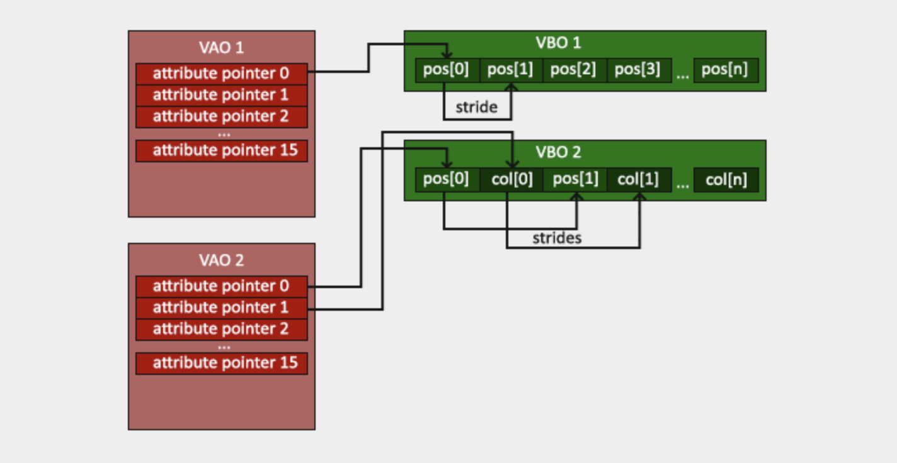

# 그래픽스 파이프라인

opengl이 하는 일은 3d좌표를 2d픽셀로 바꾸는 것이다. 이것을 하는 것이 opengl의 graphics pipeline이다. 파이프라인은 두 개의 파트로 나뉜다.

- 3d 좌표를 2d 좌표로 바꾸기
- 2d 좌표를 색깔 픽셀로 바꾸기

그래픽카드는 수천개의 processing core를 갖고 있다. 파이프라인 안에서 데이터를 빠르게 공정하기 위해. processing coresms 각 단계마다 작은 프로그램을 실행한다. 그 작은 프로그램이 shader이다. shader는 개발자가 configure할 수 있다. shader는 opengl shader language(GLSL)로 쓰인다.

vertex data[] => vertex shader => geometry shader => shape assembly => rasterization => fragment shader => tests and blends

- `vertex data`: primitive를 이루어야 하는 몇 개의 3d 좌표들의 모음. 위치, 색깔 등 원하는 데이터를 담을 수 있다.
- `vertex shader`: vertex 하나를 인풋으로 받는다. 3d좌표를 다른 3d좌표로 바꾸는 등 attribute를 바꾼다.
- `geometry shader`: primitive를 이루는 vertex들을 받아서 새로운 primitive를 이루는 새로운 vertex들을 생성한다.
- `primitive assembly`: primitive를 이루는 vertex들을 받아서 primitive 모양대로 조립한다.
- `rasterization`: primitive들을 대응하는 픽셀에 맵핑한다. 즉 fragment shader가 사용할 fragment를 생성한다. 그리고 fragment shader 실행 전 clipping된다. clipping은 view에서 보이지 않는 fragment를 제거한다. fragment는 하나의 픽셀을 렌더하기 위해 필요한 데이터다.
- `fragment shader`: 3d씬의 정보를 포함해서(빛,그림자,빛색 등) 픽셀의 색을 결정한다.
- `tests and blend`: fragment의 depth를 체크 -> 앞뒤 판단해서 버릴거 버린다.
alpha값(투명도) 체크 -> 색을 섞는다.

우리는 vertex shader랑 fragment shader만 신경쓰면 된다.

# NDC

opengl은 3d좌표의 xyz가 모두 -1.0 과 1.0 사이일 떄만 2d좌표로 바꿔준다. 이 좌표를 normalized device coordinates라고 한다. 그 안에있는 것만 스크린에 보인다. ndc좌표는 `glViewPort`에서 제공한 데이터를 사용해서 screen space 좌표로 바뀐다.

# Vertex Buffer Object

그래픽 파이프라인의 인풋으로 vertex data를 넣자. GPU에 메모리를 생성하고, 어떻게 이 메모리를 opengl이 해석하게할지 configure하고, 어떻게 그래픽카드에 데이터를 보낼지 알려줘야 한다. 그러면 vertex shader가 데이터를 받을 수 있다.

이 메모리를 vertex buffer object를 이용해서 처리한다. VBO는 GPU의 메모리에 많은 vertex를 저장할 수 있다. CPU에서 GPU로 보내는 게 느리고, 일단 GPU에 들어가면 바로 vertex shader가 접근할 수 있기 떄문에 최대한 한 번에 많이 보내는 게 좋다.

openGL object는 id가 있어야 한다. VBO를 위해 id를 만들어준다.

```
unsigned int VBO;
glGenBuffers(1, &VBO);
```

id는 GPU 주소가 아닌 opengl 내부 객체를 가리키는 손잡이다. `glGenBuffers`를 함으로써 opengl 내부에 buffer object를 하나 등록하고 그 id를 받는 것이다.

opengl의 철학은 객체를 직접 만지지 말고 특정 슬롯에 넣어놓고 그 슬롯을 통해 작업해라라는 것이다. 되게 간접적인 것 같다.

`GL_ARRAY_BUFFER`는 하나의 슬롯이다. VBO의 타입이 `GL_ARRAY_BUFFER`이다.

```
glBindBuffer(GL_ARRAY_BUFFER, VBO);
```

앞으로 `GL_ARRAY_BUFFER`슬롯에 대한 작업은 이 VBO, 새롭게 등록된 buffer object에게 적용해라 라는 뜻이다.

이렇게 중간에 슬롯을 둠으로써, 객체를 인자로 넘기지 않는다. 대신 지금 이 타입의 현재 객체(current object)는 누구다 라는 전역 상태를 설정한다. 함수에 객체 핸들을 넘기는 것보다 상태 설정+명령이 더 빨라서 이런 식으로 한다고 한다. C는 참 이상해

그래서 그 상태 슬롯이 변수인가 물었더니 그건 아니라고 한다. 이유는
1. 접근 방식이 다르다. 변수는 직접 읽고 쓰지만 슬롯은 함수 호출로만 변경한다.
2. 스코프 개념이 다르다. 변수는 함수 또는 블록 스코프를 가지지만 슬롯은 opengl context 전역이다.
3. 슬롯은 타입 시스템이 없다.

변수가 숫자 적힌 메모지라면 슬롯은 믹싱 콘솔의 다이얼이다.

```
glBufferData(GL_ARRAY_BUFFER, sizeof(vertices), vertices, GL_STATIC_DRAW);
```

`glBufferData`는 데이터를 버퍼에 복사해 넣는 함수다.
인자는
1. VBO
2. 데이터의 사이즈 in bytes
3. 데이터
4. 그래픽카드가 데이터를 어떻게 처리할지. STREAM_DRAW는 한 번 set하고 한 번 사용, STATIC_DRAW는 한 번 set하고 여러 번 사용, DYNAMIC_DRAW는 많이 바뀌고 많이 사용.

# Vertex shader
```
#version 330 core
layout(location = 0) in vec3 aPos;

void main()
{
  gl_Position = vec4(aPos.x, aPos.y, aPos.z, 1.0);
}
```

맨 첫줄에서 버전 선언. `in` 키워드로 vertex 데이터를 선언함. 지금은 position 데이터밖에 없으니까 하나만 있으면 됨. vertex가 3d좌표니까 vec3이고 이름은 aPos로 지어줌.

vertex shader의 아웃풋을 위해 gl_Position이라는 미리 정의된 변수에 position 데이터를 넣어줘야 한다. 맨 마지막 파라미터는 perspective를 위해 쓰인다.

# Compiling a shader

shader의 코드를 const C string으로 저장해 놓는다.

opengl이 shader를 쓰기 위해서는 런타임에 소스코드를 컴파일해야 한다. 그러기 위해서 shader object를 만들어서 Id를 받아야 한다.

```
unsigned int vertexShader;
vertexShader = glCreateShader(GL_VERTEX_SHADER);
```

만들고 싶은 shader의 타입을 `glCreateShader`에 인자로 넣는다고 한다.

```
glShaderSource(vertexShader, 1, &vertexShaderSource, NULL);
glCompileShader(vertexShader);
```

buffer object에 데이터 넣을 때처럼 `glShaderSource`는 shader object와 몇개인지와 소스코드를 받는다.

# Fragment shader

컴퓨터그래픽스에서 색은 rgba고 각각 0.0에서 1.0의 값을 가진다.

```
#version 330 core
out vec4 FragColor;

void main()
{
  FragColor = vec4(1.0f, 0.5f, 0.2f, 1.0f);
}
```

fragment shader는 vec4인 하나의 아웃풋 변수만 필요하다. `out`키워드로 아웃풋 값 `FragColor`를 선언한다. 그리고 색깔을 넣어준다. 그리고 vertex shader와 똑같이 shader object를 만들고 소스코드를 넣고 컴파일한다.

```
unsigned int fragmentShader;
fragmentShader = glCreateShader(GL_FRAGMENT_SHADER);
glShaderSource(fragmentShader, 1, &fragmentShaderSource, NULL);
glCompileShader(fragmentShader);
```

# Shader Program

컴파일된 shader들을 사용하기 위해 그것들을 shader program이라는 object에 link해야 한다. 그리고 렌더할 때 이 shader program을 activate해야 한다. shader들을 link할 때 한 shader의 아웃풋을 다음 shader의 인풋에 link하게 된다. (그럼 중간과정은...?) 그래서 output과 input이 서로 안 맞으면 에러가 난다.

```
unsigned int shaderProgram;
shaderProgram = glCreateProgram();
```

`glCreateProgram`은 program을 만들고 id를 program object에 리턴한다. 이제 `glAttachShader`로 컴파일된 shader들을 program object에 attach하고 `glLinkProgram`으로 link한다.

```
glAttachShader(shaderProgram, vertexShader);
glAttachShader(shaderProgram, fragmentShader);
glLinkProgram(shaderProgram);
```

결과는 `glUseProgram`으로 activate할 수 있는 program object이다. shader를 program에 링크한 후에는 shader object를 `glDeleteShader`로 delete해야 한다.

# Linking Vertex Attributes

여기까지 GPU에 vertex data를 전송하고(VBO를 이용해) shader 안에서 어떻게 vertex data를 처리할지 opengl에게 알려줬다.

opengl은 아직 GPU 메모리에 들어있는 vertex data를 어떻게 해석하고 vertex shader의 attribute랑 연결시킬지 모른다. `glVertexAttribPointer`를 이용해 vertex attribute의 형태를 알려줘야 한다. 그리고 vertex attribute는 디폴트가 disabled라서 `glEnableVertexAttribArray`로 enable해야 한다.

vertex buffer data는 이런 모양이다
- 4 byte(32-bit) 3개 -> 위치
- 빈칸 없음. 데이터의 첫 값이 buffer의 시작점임

```
glVertexAttribPointer(0, 3, GL_FLOAT, GL_FALSE, 3 * sizeof(float), (void*)0);
glEnableVertexAttribArray(0);
```

- 무슨 vertex attribute를 configure하고싶은지: (location = 0)이라고 적은 것처럼 vertex attribute의 location은 0임.
- vertex attribute의 크기: vec3였음
- vertex attribute의 타입: vec은 float으로 이루어짐
- integer이고 normalize하고 싶은지: 아님
- stride: vertex attribute들 사이의 거리
- offset

# Vertex Array Object

만약 VAO가 없다면, 뭔가를 draw할 때마다 이걸 반복해야 할 것이다.

```
glBindBuffer(GL_ARRAY_BUFFER, VBO);
glBufferData(GL_ARRAY_BUFFER, sizeof(verticies), vertices, GL_STATIC_DRAW);

glVertexAttribPointer(0, 3, GL_FLOAT, GL_FALSE, 3 * sizeof(float), (void*)0);
glEnableVertexAttribArray(0);

glUseProgram(shaderProgram);
```

이 configuration들을 object에 보관하고 그게 state를 알아서 restore하게 할 수 있다.

VAO도 VBO처럼 bind될 수 있고, 그 안에서 이루어지는 vertex attribute call은 저장된다. 그래서 그걸 한 번만 하면 된다. 그러면 vertex data와 attribute configuration들 사이 스위치하는 게 더 쉽다(VAO 바인딩으로 처리되니까)



```
unsigned int VAO;
glGenVertexArrays(1, &VAO);
```

VAO를 bind하려면 `glBindVertexArray(VAO)`만 하면 된다. 여러개의 물체를 렌더할 때 VAO도 여러개 만들어서 bind하고 draw하고 unbind하면 된다.

# draw

렌더 루프 안에서 `glDrawArrays`를 하면 currently active shader, previously defined vertex attribute configuration과 vertex data를 이용해서 primitive를 그린다. 이래서 opengl이 순서에 강하게 의존한다는 건가?

# Element Buffer Objects

사각형을 그리기 위해 삼각형 두개를 그릴때 중복되는 vertex 2개가 존재한다. unique한 vertex만 쓰고 순서만 정해줄 수 있으면 좋지 않을까?

그것이 EBO의 역할이다. EBO도 버퍼인데,  opengl이 어떤 vertex를 그릴지 결정할 수 있는 index들을 저장한다.

```
GLuint EBO;
glGenBuffers(1, &EBO);

glBindBuffer(GL_ELEMENT_ARRAY_BUFFER, EBO);
glBufferData(GL_ELEMENT_ARRAY_BUFFER, sizeof(indices), indices, GL_STATIC_DRAW);

glDrawElements(GL_TRIANGLES, 6, GL_UNSIGNED_INT, 0);
```

VBO와 마찬가지로 buffer object id 받고, bind하고(ELEMENT_ARRAY_BUFFER에), data 넣고(indices를), `glDrawElements`한다. 여기서 6은 Indices의 갯수. EBO도 VAO에 묶여있어야 한다(`glBindVertexArray(VAO)`이후에 bind할 것.)