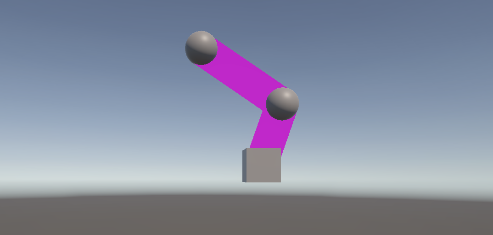
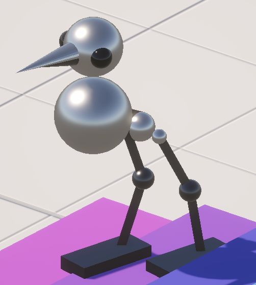

Fabrik을 이용해 걷는 새 다리를 만들었다.

코드: https://github.com/solm0/procedural_bird/tree/2d40fa962466f411a5e78d5c9ca13c6f1a485fe8

# Fabrik2D
- forward and backward inverse kinematics의 약자
- 관절들을 앞으로, 뒤로 밀고 당기는 것을 반복하여 최종적으로 두 극단 사이 적절한 관절의 위치를 구하는 알고리즘

## 다리 한 짝 만들기



1. empty gameobject 'Hip' > 'Mid' > 'End' 만들고 그 위치에 sphere 추가
2. empty gameobject 'Target' 만듦
3. 스크립트 `LegIK` 만들고 1의 부모 'Leg'에 붙이기
4. empty gameobject 'Upper', 'Lower' 만들고 Component > Effects > Line Renderer 클릭해 선 만들음.

## 걷는 새 만들기



5. 'Leg' 복제, 'Target' 복제, 두 'Leg'의 부모 'Legs' 만들기
6. 스크립트 `WalkController` 만들고 'Legs'에 붙이기
7. 스크립트 `FootController` 만들고 각 'Target'에 붙이기

## Fabrik2D 구현 방법

반복계산 중 나오는 값을 저장하기 위한 변수 p0-p2를 만든다.
- p0 = hip.position
- p1 = mid.position
- p2 = end.position

관절들 사이 거리는 일정하게 유지한다.
- upperLen = hip.position - mid.position
- lowerLen = mid.position - end.position

1단계: Forward
1. p2 = target.position
2. p1 = p2 + normalize(p1 - p2) * lowerLen;
3. p0 = p1 + normalize(p0 - p1) * upperLen;

2단계: Backward
1. p0 = hip.position
2. p1 = p0 + normalize(p1 - p0) * upperLen;
3. p2 = p1 + normalize(p2 - p1) * lowerLen;

A와 B를 5-10번 반복한다.

# LegIK

## 변수 선언

모든 관절과 target의 Transform를 public 변수로 받는다.

```c#
public Transform hip;
public Transform mid;
public Transform end;
public Transform target;
```

## Start()

관절들 사이의 거리를 가져온다. `Distance()`는 두 Vector3의 scalar distance를 리턴한다.

```c#
upperLen = Vector3.Distance(hip.position, mid.position);
lowerLen = Vector3.Distance(mid.position, end.position);
```

## LateUpdate()

### fabrik IK

p0-p2를 현재 위치로 초기화한다.

```c#
Vector3 p0 = hip.position;
Vector3 p1 = mid.position;
Vector3 p2 = end.position;
```

1단계와 2단계를 반복한다.

```c#
for(int i = 0; i < maxIterations; i++)
{
  // Forward
  p2 = target.position;
  p1 = p2 + (p1 - p2).normalized * lowerLen;
  p0 = p1 + (p0 - p1).normalized * upperLen;

  // Backward
  p0 = hip.position;
  p1 = p0 + (p1 - p0).normalized * upperLen;
  p2 = p1 + (p2 - p1).normalized * lowerLen;
}
```

A(0,0)과 B(1,1)이 있다고 할 때 A-B=(-1,-1)이고 B-A=(1,1)이다. A에서 B로 가려면 A에 B-A를 더해야 한다.

Forward에서는 p2가 target.position으로 설정되고,
`p2가 p1로 가는 방향 * 거리 = 새로운 p1`,
`p1가 p0으로 가는 방향 * 거리 = 새로운 p0`,

Backward에서는 p0이 hip.position으로 설정되고,
`p0이 p1로 가는 방향 * 거리 = 새로운 p1`,
`p1가 p2로 가는 방향 * 거리 = 새로운 p2`,

이것을 정해진 횟수만큼 반복한 결과가 그 프레임의 관절들의 위치가 된다.

### 옆으로 접힘 방지

다리의 관절들은 한 축으로만 접혀야지 좌우로 접히면 안된다.

```c#
Vector3 planeNormal = hip.right;
Vector3 p1Dir = Vector3.ProjectOnPlane(p1 - hip.position, planeNormal).normalized;
Vector3 p2Dir = Vector3.ProjectOnPlane(p2 - p1, planeNormal).normalized;

p1 = hip.position + p1Dir * upperLen;
p2 = p1 + p2Dir * lowerLen;
```

hip.right는 관절의 오른쪽 방향이다. 이것을 normal로 하는 평면은 hip.right 방향과 수직인 모든 방향을 포함한다. `ProjectOnPlane(v, planeNormal)`은 planeNormal을 기준으로 평면을 정의하고 v를 그 평면 위에 놓는다. 그것을 normalize해서 두 관절 사이 거리에서 right 방향을 제거한 방향 `p1Dir`, `p2Dir`을 구한다.

방향에 미리 고정되어 있는 관절 사이 거리를 곱한 것을 더해서 관절들의 위치를 재계산한다.

### 앞으로 접힘 방지

새의 발뒷꿈치(=mid=p1)는 뒤쪽으로만 접혀야 한다.

```c#
Vector3 aLocal = hip.InverseTransformPoint(p1);
if (aLocal.z > 0f) aLocal.z = -aLocal.z;
p1 = hip.TransformPoint(aLocal);
```

`InverseTransformPoint`로 p1을 hip의 로컬좌표계로 변환한다. 그러면 `aLocal.z`는 hip 기준으로 앞뒤가 된다. -z를 앞으로 보고, z가 양수면 뒤집어준 뒤 `TransformPoint`로 다시 월드좌표계로 변환한다.

### 계산된 값 적용

```c#
mid.position = p1;
end.position = p2;
```

### 다리 line 그리기

```c#
upper.SetPosition(0, root.position);
upper.SetPosition(1, mid.position);

lower.SetPosition(0, mid.position);
lower.SetPosition(1, end.position);
```

# WalkController

이 스크립트가 붙는 'Legs' gameobject가 걷기 로코모션의 본체이다. 'Legs'가 인풋에 따라 앞뒤 이동하고 회전하는 것에 새의 다른 부분들의 위치와 회전값, 발걸음이 좌우된다.

## 인풋 받아 움직임

`Input.GetAxis` 해서 `transform.Translate`, `transform.Rotate` 사용해 움직인다.

```c#
float forwardInput = Input.GetAxis("Vertical");
float horizontalInput = Input.GetAxis("Horizontal");

transform.Translate(Vector3.forward * Time.deltaTime * speed * forwardInput);
transform.Rotate(Vector3.up * Time.deltaTime * turnSpeed * horizontalInput);
```

## 레이캐스트

발을 지면에 붙이는 데 쓰는 레이캐스트와 별개로 몸통의 높이를 조절하기 위해서 한다. 발만 계단 위로 올라가고 몸통은 바닥에 서 있을 때와 같은 높이면 안되니까.

```c#
float rayHeight = 10f;
float rayDistance = 20f;
Vector3 rayOrigin = transform.position + Vector3.up * rayHeight;
```

'Legs'는 0, 0, 0 위치에 있다. 그래서 그 위쪽으로 `rayHeight`만큼 떨어진 위치에 ray의 origin 위치를 설정한다.

```c#
public LayerMask groundMask;

if (Physics.Raycast(rayOrigin, Vector3.down, out RaycastHit hit, rayDistance, groundMask))
{
    float height = 0.1f;
    transform.position = new Vector3(
        transform.position.x,
        hit.point.y + height,
        transform.position.z
    );
}
```

그리고 그 `rayOrigin`에서 아래 방향으로 `rayDistance` 만큼의 길이인 ray를 쏜다. groundMask는 실수로 땅이 아닌 자기 발을 쏘는걸 방지하기 위해 오브젝트를 구분한다. inspector에서 지형 오브젝트들의 layer를 ground로 설정했다.

# FootController

'Legs'(=root), 그리고 이 target이 조종할 발(=foot)을 가져온다

```c#
public GameObject root;
public GameObject foot;
```

## root와 현재 발의 거리 계산

root와의 거리를 계산한다. 몸통과 다리가 앞뒤로 얼마나 떨어졌는지만 고려하면 되기 때문에 root의 앞 방향과 내적해서 최종 거리를 구한다.

```c#
Vector3 dist = root.transform.position - transform.position;
Vector3 forward = root.transform.forward;
forward.Normalize();

float forwardDist = Vector3.Dot(dist, forward);
```

## stepping 준비

그리고 이 거리가 기준치보다 높아지면 발걸음을 떼기 위한 준비를 한다. 시작위치 startPosition과 목표위치 targetPosition을 정하고,

```c#
private float maxDist = 2.0f;
private float offsetZ = 4.0f;

if (!isStepping && Mathf.Abs(forwardDist) > maxDist)
{
  // startPosition, targetPosition 설정
  startPosition = foot.transform.position;
  Vector3 move = root.transform.forward * forwardInput * offsetZ;
  targetPosition = startPosition + move;

  ...
```

레이캐스트 결과인 hit의 높이 y값과 회전 normal을 얻는다.

```c#
  ...

  // targetPosition 높이 조정
  float rayHeight = 10f;
  float rayDistance = 20f;
  Vector3 rayOrigin = targetPosition + Vector3.up * rayHeight;

  if (Physics.Raycast(rayOrigin, Vector3.down, out RaycastHit hit, rayDistance, groundMask))
  {
      targetPosition.y = hit.point.y;
      targetNormal = hit.normal;
  }

  ...
```

그리고 isStepping을 true로 바꾸어 stepping을 시작한다.

```c#
  ...

  isStepping = true;
  stepProgress = 0f;
}
```

## stepping

stepProgress를 증가시킨다. `Clamp01`은 값을 0-1 내로 유지시킨다.

```c#
if (isStepping)
{
  float totalDistance = Vector3.Distance(startPosition, targetPosition);
  stepProgress += (speed * Time.deltaTime) / totalDistance;
  stepProgress = Mathf.Clamp01(stepProgress);

  ...
```

`Lerp`를 이용해 startPosition과 targetPosition 사이 stepProgress 보간 값 basePos을 얻는다. `Sin`을 이용해 발의 높이를 아치형으로 높이는 값 yArc을 얻는다. basePos와 yArc를 적용한다.

```c#
  ...

  Vector3 basePos = Vector3.Lerp(startPosition, targetPosition, stepProgress);
  float yArc = Mathf.Sin(Mathf.PI * stepProgress) * yLimit;

  transform.position = new Vector3(
      basePos.x,
      basePos.y + yArc,
      basePos.z
  );

  ...
```

레이캐스트에서 얻은 지면의 기울기를 사용해 foot를 회전시킨다.

```c#
  ...

  Quaternion targetRot = Quaternion.FromToRotation(transform.up, targetNormal) * transform.rotation;
  transform.rotation = targetRot;
  
  foot.transform.rotation = Quaternion.Euler(targetRot.eulerAngles.x, root.transform.rotation.eulerAngles.y, targetRot.eulerAngles.z);

  ...
```

발걸음을 멈춘다.

```c#
  ...
  
  if (stepProgress >= 1f)
    isStepping = false;
}
```